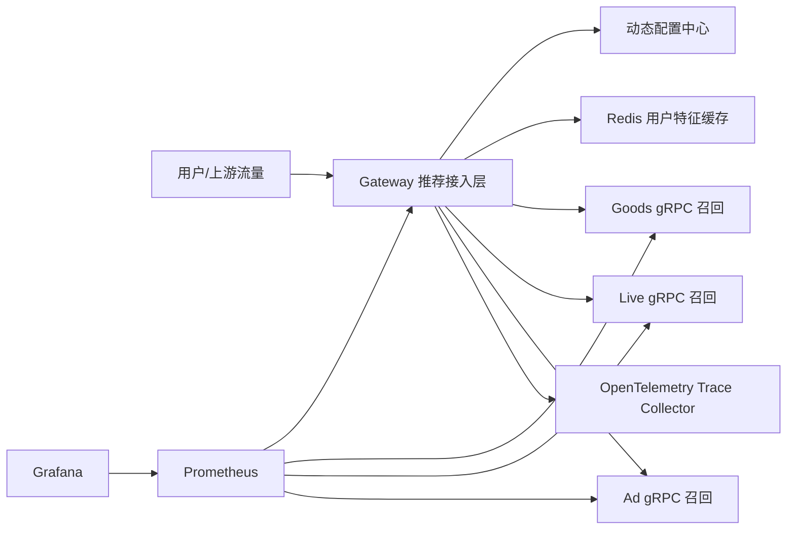
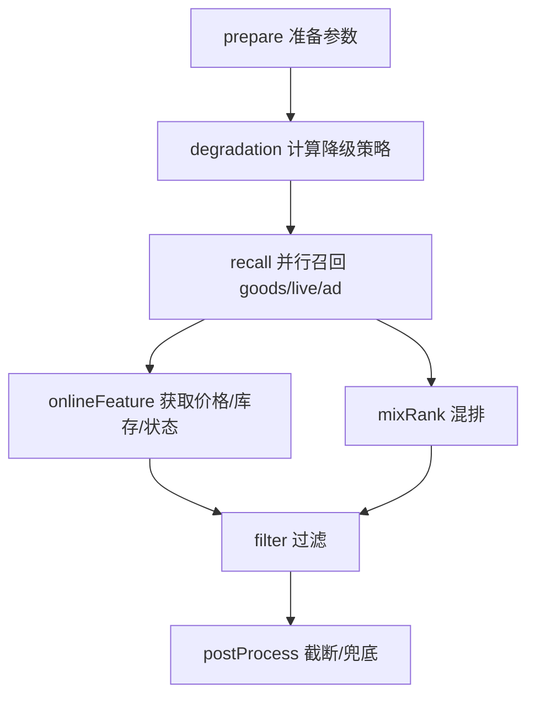
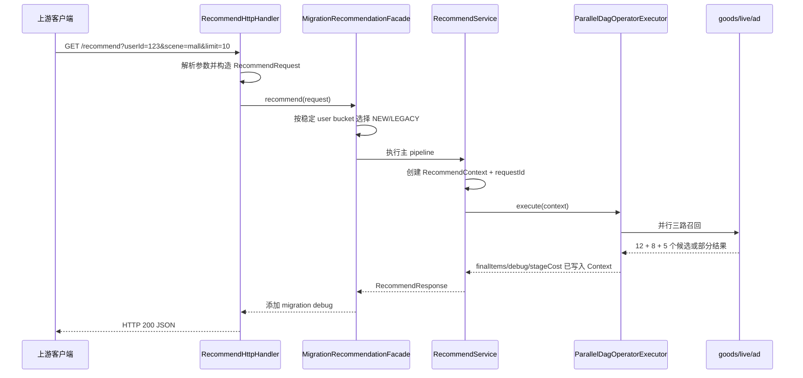

# Mini Reco 从零入门：把 V1～V20 串成一个完整的大厂推荐接入层项目

> 适合对象：没有推荐系统、大厂后端、微服务、单元测试或工程化经验的初学者。
>
> 学习目标：不只把项目运行起来，还要能解释一次请求怎样执行、每个目录做什么、为什么要重构、各种中间件解决什么问题，以及面试官继续追问时该怎样回答。

---

## 0. 先不要急着逐行读代码

这个项目包含 169 个左右的主代码源文件和从 V1 到 V20 的完整演进。新手最容易犯的错误，是打开第一个类后从第一行一直读，读到 gRPC、DAG、熔断、Kubernetes 时彻底迷路。

正确顺序是：

1. 先理解它在业务上解决什么问题；
2. 再记住一次请求的主链路；
3. 然后只看七个核心算子；
4. 再理解数据为什么从 Big Map 重构成强类型 Context；
5. 最后学习 gRPC、Redis、监控、Kubernetes 等外围工程能力。

你可以先把整个项目记成一句话：

> 它是一个电商推荐接入层：接收用户请求，准备用户信息，并行调用商品、直播和广告三路召回，把候选内容补充实时特征、混排、过滤和兜底，最后返回结果；同时具备灰度、降级、容错、监控、缓存、容器部署和容量验收能力。

如果现在还不懂“召回”和“混排”，没关系，下一节从零解释。

---

## 1. 推荐系统到底在做什么

假设商城中有一亿件商品，用户打开首页时需要在 200ms 左右看到 10～20 个内容。系统不可能把一亿件商品全部交给复杂模型打分，因此通常分层处理：

```text
海量内容
   ↓ 召回：快速找出几百或几千个可能相关的候选
候选集合
   ↓ 粗排/精排/混排：计算相关性并组织商品、直播、广告
有序结果
   ↓ 过滤、兜底、打点
用户最终看到的列表
```

### 1.1 什么是“接入层”

接入层位于流量入口与算法/召回服务之间。它不负责训练推荐模型，主要负责工程编排：

- 承接商城、买首、单列、双列等不同场景；
- 解析和校验参数；
- 获取用户特征、AB 参数、地址；
- 调用商品、直播、广告等下游；
- 控制超时、重试、熔断、降级和兜底；
- 编排混排和过滤的先后或并行关系；
- 输出日志、指标和分布式链路；
- 支持灰度发布、动态配置与快速回滚。

可以把接入层理解为餐厅的“前厅经理”：他不亲自种菜，也不一定亲自炒菜，但要接单、分派多个档口、控制超时、合并菜品、处理某个档口停工并确保客人最终拿到一桌菜。

### 1.2 本项目的三路召回

| 来源 | 含义 | 正常返回数量 |
|---|---|---:|
| goods | 普通商品召回 | 12 |
| live | 直播间/直播商品召回 | 8 |
| ad | 广告商品召回 | 5 |

三路健康时共有 25 个候选。若 live 宕机，goods + ad 仍有 17 个候选；后处理会用热门内容补足用户要求的数量，所以接口可能仍然 HTTP 200。这也是为什么监控不能只看 HTTP 成功率，还要看 `FALLBACK` 和候选数量。

---

## 2. 先建立完整架构图

### 2.1 运行时架构



在最终 V20 的 Docker Compose 环境里，一共有七个核心容器：

1. gateway；
2. goods；
3. live；
4. ad；
5. trace-collector；
6. config-center；
7. redis。

Prometheus 和 Grafana 在监控 profile 中按需启动；Kubernetes 版本则使用 Deployment、Service、ConfigMap、HPA、PDB 和探针管理应用。

### 2.2 网关内部的 DAG



这里最重要的设计是：`onlineFeature` 和 `mixRank` 在 recall 结束后并行执行，filter 必须等二者都结束。

为什么这样做？

- 在线特征查询与候选数量成正比，扩召回后可能需要约 100～120ms；
- 混排本身也需要约 100～120ms；
- 串行时两者相加约 200～240ms；
- 并行时总时间接近较慢的一方，另一方的开销被覆盖。

代价是什么？混排看到的是过滤前的候选，过滤后若有内容被删除，最终需要用后续结果或兜底内容补位，结果可能与“先过滤再混排”不完全一致。工程上需要根据打点确认被过滤量很小，再用性能收益换取这一点结果差异。

---

## 3. 运行项目前需要懂的最少知识

### 3.1 Java 类、接口和对象

- **类（class）**：一张对象设计图，例如 `Item` 定义商品有什么字段和行为。
- **对象（object）**：按设计图创建出的具体实例，例如商品 10101。
- **接口（interface）**：只规定“能做什么”，不规定“怎么做”，例如 `RecallService` 规定召回服务必须有 `source()` 和 `recall()`。
- **实现类**：真正完成接口行为，例如本地 `GoodsRecallService` 或远程 `GrpcGoodsRecallService`。
- **构造函数**：创建对象时注入它需要的依赖。

项目大量使用接口，是为了让核心流程不依赖具体实现：本地演示可以调用 Java 对象，上线可以切成 gRPC，测试时可以换成 Mockito 假对象。

### 3.2 Maven

Maven 负责依赖下载、代码生成、编译、测试和打包。核心文件是根目录的 `pom.xml`。

常用命令：

```powershell
mvn test       # 编译并执行 JUnit 测试
mvn package    # 测试后生成可运行 fat JAR
mvn -DskipTests package  # 跳过测试，仅打包；日常提交前不建议跳过
```

最终产物：

```text
target/mini-reco-access-layer-0.1.0-SNAPSHOT.jar
```

这个 JAR 已通过 Maven Shade Plugin 合并运行依赖和 SPI 文件，可直接 `java -jar`。

### 3.3 HTTP、JSON、gRPC、Protobuf

- **HTTP**：上游访问网关的协议，便于浏览器和普通客户端调用。
- **JSON**：HTTP 接口的人类可读文本格式。
- **Protobuf（PB）**：用 `.proto` 描述的二进制数据协议，字段类型明确、体积小、易演进。
- **gRPC**：基于 HTTP/2 和 Protobuf 的远程调用框架，本项目用它调用三路召回。

一句话区分：PB 定义“数据长什么样”，gRPC 定义“远程方法怎样调用”。

### 3.4 线程与并行

串行像一个人依次去三个窗口；并行像三个人同时排三个窗口。若三路耗时分别为 50、40、25ms：

```text
串行理论耗时 ≈ 50 + 40 + 25 = 115ms
并行理论耗时 ≈ max(50, 40, 25) = 50ms + 少量调度开销
```

并行不是免费午餐：线程池太小会排队，太大会争抢 CPU 和内存；共享对象写入还需要考虑线程安全。

---

## 4. 第一次把项目跑起来

### 4.1 最简单的单进程模式

在项目根目录执行：

```powershell
mvn test
.\scripts\run.ps1
```

`run.ps1` 会打包并在 8080 端口启动网关。默认 `RECALL_TRANSPORT=local`，所以 goods/live/ad 是同一 JVM 中的本地 Java 实现，不需要 Docker。

另开一个 PowerShell：

```powershell
Invoke-RestMethod 'http://localhost:8080/health'
Invoke-RestMethod 'http://localhost:8080/recommend?userId=123&scene=mall&limit=10'
```

合法 scene 包括：

```text
mall
buy_first
single_column
double_column
new_user_card
```

`HOME` 不合法，会在 prepare 阶段得到 `unsupported scene`。

### 4.2 看懂返回值

推荐响应的关键结构：

```json
{
  "requestId": "一次请求的唯一 ID",
  "userId": 123,
  "scene": "mall",
  "costMs": 220,
  "items": ["最终推荐内容"],
  "debug": {
    "recallItemCount": 25,
    "returnedItemCount": 10,
    "stageCostMs": {"prepare": 1, "recall": 55},
    "resilience": {"goods": {}, "live": {}, "ad": {}},
    "migration": {"primaryPipeline": "NEW"}
  }
}
```

观察顺序：

1. `items.Count` 是否等于 limit；
2. `recallItemCount` 是否为健康状态的 25；
3. 三路 `resilience.*.status` 是否都是 `SUCCESS`；
4. `stageCostMs` 哪一步最慢；
5. `migration` 当前走 NEW 还是 LEGACY；
6. item 的 `source` 是否包含 fallback。

---

## 5. 项目目录到底放了什么

```text
mini-reco-access-layer/
├─ pom.xml                     Maven 构建、依赖、PB/gRPC 代码生成
├─ Dockerfile                  把 fat JAR 做成非 root Java 镜像
├─ compose.yaml                多容器拓扑、健康检查、资源限制
├─ deploy/k8s/                 Kubernetes base、overlay、监控资源
├─ monitoring/                 Prometheus 规则和 Grafana Dashboard
├─ scripts/                    每个版本可重复运行的验收脚本
├─ docs/                       从基础测试到 V20 的学习文档
├─ src/main/proto/             上下游 PB 与 gRPC service 定义
├─ src/main/java/...           生产代码
└─ src/test/java/...           JUnit、Mockito、集成测试
```

Java 包的职责：

| 包 | 作用 | 入门时何时看 |
|---|---|---|
| `domain` | Request、Response、Item、特征等领域对象 | 第一批 |
| `http` | 解析 HTTP 参数、调用服务、写 JSON | 第一批 |
| `service` | 核心推荐服务和对象组装 | 第一批 |
| `service/context` | 一次请求过程中的强类型数据容器 | 第一批 |
| `service/operator` | 算子接口、配置、执行引擎 | 第二批 |
| `service/operator/graph` | DAG 定义、校验与并行调度 | 第二批 |
| `service/downstream` | 特征、地址、召回、混排等依赖接口 | 第二批 |
| `proto` | 不同 PB 的 Adapter 与代码预热 | 第三批 |
| `grpc` | 三路远程召回客户端、服务端、健康检查 | 第三批 |
| `resilience` | 超时、有限重试、熔断、隔离、兜底 | 第三批 |
| `migration` | 新旧链路路由、shadow 双跑与 diff | 第三批 |
| `degradation` | 分层降级策略 | 第三批 |
| `observability` | 日志、指标、告警、Prometheus | 第三批 |
| `telemetry` | OpenTelemetry Trace 和收集器 | 第三批 |
| `config` | 动态配置中心与网关轮询 | 第四批 |
| `cache` | Redis 用户特征缓存 | 第四批 |
| `capacity` | 压测、分位数与 SLO 报告 | 第四批 |
| `benchmark` | 降级性能基准 | 第四批 |
| `ops` | 容器健康探针小工具 | 部署时看 |

不要一开始就读 `generated-sources`。那是 Maven 根据 `.proto` 自动生成的代码，理解输入的 proto 和调用方式即可。

---

## 6. 服务启动时发生了什么

入口文件：

```text
src/main/java/com/interview/minireco/MiniRecoApplication.java
```

按顺序发生：

1. `resolvePort()` 决定监听端口；
2. `Telemetry.initialize()` 初始化 OpenTelemetry；
3. `ProtoRuntimeWarmup.initialize()` 提前加载 PB 运行时，减少首请求抖动；
4. `DemoWiring.createRoutedRecommendService()` 组装新旧四条 pipeline；
5. 获取全局指标、告警、降级、容错、灰度等管理器；
6. 若设置 `CONFIG_CENTER_URL`，启动后台配置轮询；
7. 创建 JDK `HttpServer`；
8. 给不同 URL 注册 `HttpHandler`；
9. 配置 16 个 HTTP 工作线程并启动服务。

主要 URL：

| URL | 作用 |
|---|---|
| `/recommend` | JSON 推荐接口 |
| `/recommend-pb` | Protobuf 二进制推荐接口 |
| `/health` | 健康检查与召回 transport 信息 |
| `/metrics` | 便于人查看的指标快照 |
| `/metrics/prometheus` | Prometheus 标准文本 |
| `/alerts` | 当前告警判断 |
| `/degradation` | 查看或修改降级级别 |
| `/resilience` | 容错状态、故障注入与 reset |
| `/rollout` | 灰度、shadow、diff、回滚 |
| `/feature-cache` | Redis 缓存命中/错误统计 |
| `/runtime-config` | 动态配置版本与 Last Known Good；仅启用配置中心时存在 |

### 6.1 `DemoWiring` 为什么重要

`DemoWiring` 是项目的“装配图”。它负责回答：

- `PrepareOperator` 具体用哪个用户特征服务？
- recall 使用 local 还是 gRPC？
- 原始召回外面包几层容错？
- 图里有哪些节点和依赖？
- 新旧 pipeline 怎样创建？

它相当于手写的依赖注入容器。生产项目常用 Spring 管理这些 Bean，本项目刻意手工组装，让初学者看清对象关系。

---

## 7. 一次 `/recommend` 请求的完整代码调用链



对应代码：

1. `RecommendHttpHandler.handle()`：校验 GET、解析 query string；
2. `RecommendRequest`：保存 userId、scene、limit，并校验基础范围；
3. `MigrationRecommendationFacade.recommend()`：按用户桶选择主链路，可能异步 shadow；
4. `RecommendService.recommend()`：创建 Context，调用执行引擎，统一记录成功/失败指标和日志；
5. `ParallelDagOperatorExecutor.execute()`：按依赖调度算子；
6. 算子把结果写入 `RecommendContext`；
7. `RecommendService` 从 Context 构造 `RecommendResponse`；
8. `JsonUtil` 把响应序列化为 JSON。

### 7.1 为什么每次请求要生成 requestId

同一时刻会有大量请求并发执行，普通日志混在一起。requestId 像快递单号：准备、召回、过滤、错误日志都带同一个 ID，排查时可以还原一条请求发生了什么。

TraceId 解决跨进程链路追踪；requestId 解决业务请求关联。两者相关但不是同一个概念。

---

## 8. 七个算子逐个讲明白

### 8.1 PrepareOperator：准备阶段

文件：`service/operator/impl/PrepareOperator.java`

职责：

- 校验 scene；
- 获取 `UserFeature`；
- 获取 AB 参数；
- 获取默认收货地址；
- 写入 `RecommendContext`。

用户特征可能包含新老用户、偏好品类、年龄。后续召回和混排都需要这些信息。

最终版本若启用 `REDIS_URL`，`FeatureCacheRuntime` 会把 `DemoUserFeatureService` 包装成 `CachedUserFeatureService`，所以 prepare 不需要知道 Redis 的存在。这是装饰器思想：接口不变，外层增加缓存能力。

### 8.2 DegradationOperator：决定本次是否降级

降级不是“出错后随便少返回”，而是高负载或故障时主动减少非核心工作：

- `NONE`：不降级；
- `LIGHT`：只影响 80～99 用户桶，limit 最多 8，跳过 ad；
- `HEAVY`：影响 50～99 用户桶，limit 最多 6，跳过 ad 和 live。

使用用户桶而不是随机数，可以保证同一用户稳定地处于相同策略中。

### 8.3 RecallOperator：并行召回

它根据降级结果跳过指定来源，再交给 `ParallelRecallFanout` 并行执行。

fan-out/fan-in：

```text
               ┌─ goods ─┐
context ─ fan-out─ live  ├─ fan-in ─ 固定顺序合并
               └─ ad ────┘
```

并发完成顺序可能每次不同，但最终始终按 goods、live、ad 顺序拼接，以保证结果确定性，避免同样输入因线程调度不同而变化。

### 8.4 OnlineFeatureOperator：获取实时特征

召回结果自带的库存、价格、状态可能已经过期，因此召回后再次获取实时值。它的耗时通常与 item 数量成正比，这正是扩大召回后耗时上升的关键原因。

### 8.5 MixRankOperator：多路内容混排

混排不仅按 score 排序，还要综合用户偏好、业务规则和不同内容类型。项目的 `DemoMixRankService` 是可理解的模拟实现；真实大厂服务可能调用复杂模型和策略平台。

### 8.6 FilterOperator：过滤非法内容

当前规则保留：

```text
stock > 0 并且 status == ONLINE
```

读取属性使用 `item.findAttr(AttrName.STOCK)`，而不是字符串硬编码和 list 遍历。

### 8.7 PostProcessOperator：截断与兜底

- 结果太多：截断为 `effectiveLimit`；
- 结果太少：添加 `source=fallback` 的热门 item；
- 写入 `finalItems` 和 `returnedItemCount`。

所以“最终返回 10 条”不代表三路召回健康。必须同时查看 recallItemCount、resilience status 和 fallback 来源。

---

## 9. 为什么要用 RecommendContext，而不是一个 Big Map

早期反例：

```java
Map<String, Object> context = new HashMap<>();
context.put("user_feature", feature);
UserFeature value = (UserFeature) context.get("user_featre"); // key 拼错
```

问题：

1. key 是散落在各文件中的字符串，拼错只能运行时发现；
2. value 是 Object，需要强制类型转换；
3. 所有逻辑都能随意读写同一个 Map，耦合度高；
4. 不知道某个数据来自哪里、应该在哪个阶段产生；
5. 大对象可能被反复解析；
6. 并行算子写 Map 时还会增加线程安全风险。

最终结构：`RecommendContext` 有明确字段：

```text
request              原始请求，只读
userFeature          用户特征
abParams             AB 参数 Map
address              收货地址
recalledItems        召回候选
rankedItems          混排结果
filteredItems        过滤结果
finalItems           最终结果
degradationDecision  本次降级决定
stageCostMs          各算子耗时
debug/resilienceDebug 调试数据
telemetryContext     跨线程 Trace 上下文
```

收益：

- 编译期类型安全；
- IDE 能自动补全和查找引用；
- 字段含义、来源和生命周期清晰；
- 可以只给某些数据专门结构；
- 线程安全点被收敛到少量同步方法。

### 9.1 Item 属性为什么从 List 改成 EnumMap

List 查找指定属性需要逐个遍历，复杂度 O(n)；Map 按 key 查询平均 O(1)。本项目使用：

```java
Map<AttrName, ItemAttr> attrs = new EnumMap<>(AttrName.class);
```

`AttrName` 是枚举，所有 PRICE、STOCK、STATUS 等 key 集中注册。新增属性必须先改枚举，避免各文件随意写 `"stok"` 之类的错误字符串。

`EnumMap` 还比普通 `HashMap<Enum, ...>` 更紧凑，因为枚举集合是固定的。

---

## 10. 算子框架和 DAG 到底解决了什么

### 10.1 什么是算子

算子是一个小而明确的处理步骤：

```java
public interface Operator {
    String name();
    void execute(RecommendContext context);
}
```

它把两千行大函数拆成多个可独立测试、复用、监控和开关的节点。

### 10.2 为什么不能只写一个顺序 List

顺序 List 只能表达 A→B→C。DAG 可以表达：C 完成后同时跑 D 和 E，D/E 都完成后再跑 F。

DAG 是 Directed Acyclic Graph，即有向无环图：

- 有向：依赖有方向；
- 无环：不能 A 等 B、B 又等 A，否则永远无法执行。

`ParallelDagOperatorExecutor` 启动时先用拓扑排序检查是否有环。执行时：

1. 统计每个节点还剩几个依赖；
2. 把依赖数为 0 的节点放入 ready 队列；
3. 提交线程池执行；
4. 某节点完成后，把下游节点的剩余依赖数减一；
5. 减到 0 时提交下游；
6. 任一节点失败，取消已提交任务并让请求失败。

### 10.3 算子配置有什么用

`OperatorConfig` 支持：

- 是否启用某算子；
- 算子参数；
- 图参数或中间结果扩展。

这样一个需求可以从“改多处业务代码”变成“注册算子、配置节点和依赖”。框架统一记录每个算子的成功、错误、跳过和耗时。

### 10.4 Groovy 在原始项目和本项目中的位置

Groovy 是运行在 JVM 上的动态语言，语法比 Java 灵活，常被放在图节点中做快速策略。

优点：改策略快；缺点：

- 很多类型错误只能运行时发现；
- IDE 重构和查找引用较弱；
- 逻辑散落在脚本和配置中；
- 单测、监控、发布和负责人边界不清楚；
- 复杂脚本最后会变成难维护的“隐藏业务代码”。

因此实习重构将复杂 Groovy 脚本迁成 Java 算子：小规则仍可配置，复杂逻辑进入类型安全、可测试、可监控的代码。示例见 `docs/groovy-script-example.groovy`。

---

## 11. 三路召回从本地对象怎样演进为 gRPC 服务

### 11.1 两种 transport

`RecallTransportFactory` 根据 `RECALL_TRANSPORT` 选择：

```text
local -> GoodsRecallService / LiveRecallService / AdRecallService
grpc  -> GrpcGoodsRecallService / GrpcLiveRecallService / GrpcAdRecallService
```

核心 `RecallOperator` 只依赖 `RecallService` 接口，所以不需要随 transport 改代码。这就是依赖倒置。

### 11.2 为什么不同下游 PB 不能直接进入核心域

商品、直播、广告由不同团队维护，字段名和结构不一样：

- 商品可能叫 `product_id`；
- 直播可能叫 `room_item_id`；
- 广告可能叫 `creative_product_id`；
- 属性可能分别使用 list、map 或嵌套 message。

如果核心算子同时理解三套 PB，它会被协议细节污染。项目用 Adapter：

```text
GoodsItemPb ─┐
LiveItemPb  ─┼─ Adapter -> InternalItemPb -> 领域 Item -> 核心算子
AdItemPb    ─┘
```

边界层负责字段映射、重复 key、未知字段和协议演进，核心层只认识统一 Item。

### 11.3 为什么长期复用 ManagedChannel

每次请求新建 gRPC channel 会反复建立 TCP/HTTP2 连接，代价高且容易耗尽资源。客户端为每个下游长期复用 channel，在 JVM 关闭时通过 shutdown hook 释放。

---

## 12. 容错：下游慢或挂了，为什么网关还能返回

每个原始 RecallService 外面包了三层：

```text
ResilienceRegistry
  └─ ResilientRecallService
       └─ FaultInjectingRecallService
            └─ local/grpc RecallService
```

`ResilientRecallService` 提供：

### 12.1 超时

不能无限等下游。V20 支持三层超时：

```text
GRPC_DEADLINE_MS             内层 RPC deadline
RECALL_TIMEOUT_MS            单路韧性包装 timeout
RECALL_FANOUT_TIMEOUT_MS     多路整体 fan-out 截止
```

应满足内层 < 外层，让内层有机会先结束并把错误传播出去。

### 12.2 有限重试

瞬时网络抖动可能重试成功，但无限重试会放大下游压力。本项目最多额外重试一次，并按原因记录指标。

### 12.3 熔断

连续失败达到阈值后进入 OPEN，暂时不再调用下游；过一段时间进入 HALF_OPEN，用少量请求探测恢复；成功回 CLOSED，失败重新 OPEN。

熔断的目的不是修复下游，而是阻止已知故障持续占用线程和连接。

### 12.4 Bulkhead 隔离

每个来源有独立有界线程池和队列，像船舱隔板：live 被慢请求塞满时，不应把 goods 和 ad 的执行资源一起占光。队列满会快速产生 `bulkhead_full`，进入部分结果兜底。

### 12.5 Fallback

单路失败返回空列表，其他成功来源继续合并；最后 `PostProcessOperator` 补足结果。这是部分可用性设计。

---

## 13. 灰度、Shadow、动态配置和降级是什么关系

### 13.1 灰度发布

`RolloutManager` 使用稳定用户桶：

```text
userId % 100 < newPipelinePercent -> NEW
否则 -> LEGACY
```

5% 灰度时桶 0～4 走新链路。稳定分桶避免同一用户反复在新旧链路间跳动。

### 13.2 Shadow 双跑

主链路正常返回用户结果，同时后台异步执行另一条链路并做 diff。Shadow 结果不影响用户响应，用来观察：

- item 顺序是否一致；
- 召回数量是否变化；
- 重合率；
- 分数差异；
- 新旧耗时。

注意 Shadow 会消耗真实计算资源，比例不能随意拉到 100%。

### 13.3 动态配置

V18 配置中心管理：

- newPipelinePercent；
- shadowPercent；
- degradationLevel；
- version、updatedBy、updatedAt。

网关每 500ms 拉取，完整校验后原子更新本地管理器。请求线程只读内存，不在主链路访问配置中心。

更新必须带 `expectedVersion`。若当前已是版本 8，而客户端基于版本 7 提交，返回 HTTP 409，防止后提交的人悄悄覆盖别人的修改。这叫乐观锁。

### 13.4 Last Known Good

配置中心不可达时，网关继续使用最后一次正确配置，并把 `/runtime-config` 标为 STALE。配置故障不应让推荐请求同步失败，也不应擅自回到危险的默认全量值。

---

## 14. Redis 缓存为什么加在用户特征前

准备阶段每个请求都需要用户特征。热门用户重复查询源服务既慢又浪费容量，因此使用 cache-aside：

```text
读 Redis
  ├─ hit：反序列化后返回
  ├─ miss：查源服务 -> SET Redis -> 返回
  └─ Redis 异常：记录 error -> 查源服务 -> 返回
```

V19 同时处理三个经典问题：

- **穿透**：不存在的用户反复 miss；用 10 秒 null 哨兵。
- **击穿**：热点 key 过期时大量请求同时回源；用 `CompletableFuture` single-flight 合并成一次源调用。
- **雪崩**：大量 key 同时过期；TTL 使用 60～75 秒抖动。

Redis 是缓存而不是事实来源，因此故障时 fail-open 回源。若缓存的是安全黑名单，则可能要 fail-closed，设计要看业务语义。

---

## 15. 日志、指标和 Trace 各自回答什么问题

| 手段 | 回答的问题 | 例子 |
|---|---|---|
| 日志 Log | 某个事件具体发生了什么 | requestId=xxx 的 live timeout |
| 指标 Metric | 一段时间整体是否异常 | live fallback rate、P95 |
| Trace | 一次跨进程请求时间花在哪里 | gateway span → goods gRPC span |

### 15.1 结构化日志

日志使用 JSON 字段，而不是拼接一段自然语言。机器可以按 level、event、requestId、source、costMs 检索和聚合。

Lazy supplier 只在该日志级别真的启用时构造字段；延迟发送让业务线程少做 I/O，但要控制队列容量和进程退出时的 flush。

### 15.2 Metrics

项目记录 Counter 和耗时 Histogram，例如：

- request.success/error；
- operator.success/error/skipped/cost；
- downstream.call、retry、fallback；
- recall.fanout；
- feature_cache hit/miss/error。

Prometheus 定期抓取 `/metrics/prometheus`，Grafana 用 PromQL 展示 Dashboard，告警规则经历 Pending→Firing→Resolved。

### 15.3 Trace

OpenTelemetry Context 需要跨 HTTP 线程、DAG 线程池和 gRPC metadata 传播，否则同一次请求会断成多个不相关 Trace。

---

## 16. Docker 与 Kubernetes 分别解决什么

### 16.1 Dockerfile

把 fat JAR、Java Runtime 和启动方式做成统一镜像。本项目还强调：

- 非 root；
- 只读根文件系统；
- `/tmp` 单独可写；
- CPU/内存限制；
- 健康检查。

### 16.2 Docker Compose

适合本地多服务联调：

- 一条命令启动多个容器；
- 服务名直接作为 DNS，如 `goods:19001`；
- `depends_on + healthcheck` 控制启动顺序；
- profile 按需启用 monitoring、dynamic、cache。

### 16.3 Kubernetes

Kubernetes 进一步提供：

- Deployment 管理副本、自愈和滚动更新；
- Service 提供稳定 DNS；
- ConfigMap 管理非敏感配置；
- startup/readiness/liveness 三类探针；
- requests/limits 控制调度和资源；
- HPA 声明弹性范围；
- PDB 限制自愿驱逐；
- Kustomize 管理 base 与环境 overlay。

三个探针不要混淆：startup 判断启动完成，readiness 决定是否接流量，liveness 决定是否重启。

---

## 17. JUnit、Mockito、集成测试在这个项目中怎样配合

你的理解基本正确：

- **JUnit** 提供测试运行框架、`@Test` 和断言；
- **Mockito** 创建依赖的假对象并规定行为；
- 被测算子仍是真实对象；
- 测试构造输入 Context，执行算子，再断言 Context 输出；
- Mockito 还能验证依赖被调用几次、参数是什么。

典型结构：

```java
@Test
void shouldRecallAndStoreItems() {
    RecallService goods = mock(RecallService.class);
    when(goods.source()).thenReturn("goods");
    when(goods.recall(any())).thenReturn(List.of(item));

    RecallOperator operator = new RecallOperator(List.of(goods));
    RecommendContext context = createContext();
    operator.execute(context);

    assertEquals(1, context.getRecalledItems().size());
    verify(goods, times(1)).recall(context);
}
```

这里：

- 测试输入是自己创建的 Context；
- RecallOperator 是真实被测对象；
- goods 是 Mockito 假下游；
- `when` 规定假下游返回什么；
- `assertEquals` 检查最终状态；
- `verify` 检查交互过程。

项目还包含真正启动 gRPC socket 的集成测试，用于验证 PB、网络、metadata 和 channel，而不仅是 mock。

运行：

```powershell
mvn test
```

最终 V20 应看到 54 个测试、0 failure、0 error。

---

## 18. 从 V1 到 V20 为什么这样演进

这 20 版不是功能堆砌，而是一条“从能跑到可上线”的路线：

| 版本 | 核心变化 | 解决的问题 |
|---|---|---|
| V1 | 单体顺序推荐流程 | 先建立正确业务基线 |
| V2 | 强类型 RecommendContext | Big Map、强转和字符串 key 风险 |
| V3 | Item Attr 改 EnumMap | list 遍历和属性硬编码 |
| V4 | Operator 框架 | 大函数难测试、难复用 |
| V5 | DAG 图执行 | 流程依赖散落在代码里 |
| V6 | Parallel DAG | 在线特征与混排并行降耗时 |
| V7 | 日志、指标、单测 | 系统不可观察、重构不可验证 |
| V8 | 分层降级 | 高负载时没有主动保核心能力 |
| V9 | Benchmark | 优化缺少量化证据 |
| V10 | 超时、重试、熔断、隔离 | 下游故障拖垮网关 |
| V11 | 三路并行召回 | 顺序调用耗时叠加 |
| V12 | Shadow、Diff、灰度 | 新链路无法安全打平和发布 |
| V13 | PB Adapter | 多套下游协议污染核心层 |
| V14 | 真实 gRPC 多进程 | 本地调用不能代表网络环境 |
| V15 | Docker + OTel | 多服务难部署、Trace 断链 |
| V16 | Prometheus + Grafana | 指标没有标准采集和告警闭环 |
| V17 | Kubernetes | 缺少生产编排、自愈、滚动能力 |
| V18 | 动态配置中心 | 改灰度/降级必须重启，且并发发布会覆盖 |
| V19 | Redis cache-aside | 用户特征重复查询、缓存三大风险 |
| V20 | 容量压测与 SLO | 只知道功能正确，不知道安全容量 |

学习各版的详细文档是 `docs/01...21`。不要一天全部看完；按后面的七天计划逐层学习。

---

## 19. 推荐的七天学习计划

### 第 1 天：只跑单进程和读主链路

- 运行 `mvn test`、`scripts/run.ps1`；
- 请求 `/health` 和 `/recommend`；
- 阅读 `MiniRecoApplication`、`RecommendHttpHandler`、`RecommendService`；
- 能画出 Handler→Service→DAG→Response。

验收：关掉代码，口述一次请求怎样进入和返回。

### 第 2 天：理解业务阶段和 Context

- 阅读七个 Operator；
- 阅读 `RecommendContext`、`Item`、`AttrName`；
- 对比 Big Map 和强类型字段；
- 修改一个 item 属性并写一个小测试。

验收：解释为什么字符串 key 确实可能引发事故。

### 第 3 天：理解 Operator 与 DAG

- 阅读 `Operator`、`DagNode`、`DagGraph`、`ParallelDagOperatorExecutor`；
- 手画节点依赖；
- 故意构造 A→B→A，观察环检测测试；
- 比较在线特征/混排串行和并行耗时。

验收：用拓扑排序解释什么时候节点可以运行。

### 第 4 天：理解下游协议与容错

- 阅读 RecallService 接口、本地实现、gRPC 实现；
- 阅读 `.proto` 与 Adapter；
- 运行 `run-grpc-multiprocess-demo.ps1`；
- 运行 `run-resilience-demo.ps1`；
- 观察 25→17→25。

验收：解释 deadline、timeout、retry、circuit breaker、bulkhead 的区别。

### 第 5 天：理解灰度、降级和可观察性

- 运行 `run-rollout-demo.ps1`；
- 运行 `run-dynamic-config-demo.ps1`；
- 运行 `run-monitoring-demo.ps1`；
- 查日志、PromQL、Grafana 和 Trace。

验收：解释为什么 HTTP 200 不代表推荐质量健康。

### 第 6 天：理解缓存和部署

- 运行 `run-redis-cache-demo.ps1`；
- 用 redis-cli 观察 key 和 TTL；
- 运行 `run-docker-compose-demo.ps1`；
- 有 Docker Desktop 时运行 `run-kubernetes-demo.ps1`。

验收：解释缓存穿透、击穿、雪崩以及 Redis 故障为何能回源。

### 第 7 天：容量和面试演练

- 运行 `run-capacity-test.ps1`；
- 阅读 JSON/CSV/Markdown 报告；
- 解释并发 4 为何 QPS 更高却不算安全容量；
- 按第 22 节做 3 分钟项目介绍；
- 让同学连续追问五轮。

验收：不看文档讲清“背景—问题—方案—难点—收益—验证”。

---

## 20. 常用运行与验收命令

| 目标 | 命令 |
|---|---|
| 单元/集成测试 | `mvn test` |
| 单进程入门 | `.\scripts\run.ps1` |
| 并行召回 | `.\scripts\run-parallel-recall-demo.ps1` |
| 容错 | `.\scripts\run-resilience-demo.ps1` |
| 灰度与 Shadow | `.\scripts\run-rollout-demo.ps1` |
| PB Adapter | `.\scripts\run-protobuf-demo.ps1` |
| gRPC 多进程 | `.\scripts\run-grpc-multiprocess-demo.ps1` |
| Docker + Trace | `.\scripts\run-docker-compose-demo.ps1` |
| Prometheus + Grafana | `.\scripts\run-monitoring-demo.ps1` |
| Kubernetes | `.\scripts\run-kubernetes-demo.ps1` |
| 动态配置 | `.\scripts\run-dynamic-config-demo.ps1` |
| Redis | `.\scripts\run-redis-cache-demo.ps1` |
| V20 最终容量验收 | `.\scripts\run-capacity-test.ps1` |

脚本默认验收后清理环境。部分脚本提供 `-KeepRunning` 或 `-KeepCluster`，用于保留现场手工观察。

---

## 21. 新手怎样调试，不要只会看报错最后一行

### 21.1 请求返回 400

依次检查：

1. URL 参数是不是 `limit`，不是 `size`；
2. scene 是否在合法列表；
3. userId、limit 能否转为数字；
4. 网关日志的 `operator_error` 是哪个 operator；
5. errorMessage 是否是 `unsupported scene`。

### 21.2 返回 10 条，但候选只有 17 条

这通常不是 PostProcess 出错，而是某路召回进入 FALLBACK。检查：

```powershell
$r = Invoke-RestMethod 'http://localhost:8080/recommend?userId=123&scene=mall&limit=10'
$r.debug.recallItemCount
$r.debug.resilience | ConvertTo-Json -Depth 8
```

### 21.3 Docker 服务启动失败

```powershell
docker compose ps
docker compose logs gateway --tail 200
docker compose logs live --tail 200
```

检查镜像、健康探针、端口占用、依赖是否 healthy、环境变量是否正确。

### 21.4 Kubernetes Pod Running 但不接流量

Running 只表示容器进程存在，不代表 Ready：

```powershell
kubectl -n mini-reco get pods
kubectl -n mini-reco describe pod <pod-name>
kubectl -n mini-reco get endpointslice
```

重点看 readinessProbe 和 EndpointSlice。

### 21.5 修改代码后测试偶尔失败

先判断是确定性错误还是时间敏感测试：

- 是否把固定 deadline 设得太贴近正常耗时；
- 是否忘记等待异步任务；
- 是否复用全局 Registry 而未 reset；
- 是否测试依赖真实端口且被占用；
- 是否假设线程完成顺序等于结果顺序。

不要通过不断加 `sleep` 掩盖原因；应使用 latch、poll-until、明确 timeout 和隔离状态。

---

## 22. 面试时怎样把项目讲成一个完整故事

### 22.1 三分钟版本

> 我做的是电商推荐接入层重构。接入层上接商城、买首、单列和双列流量，下接商品、直播、广告召回及混排服务。原系统的主要问题不是单次性能，而是复杂度熵太高：请求数据集中在 `Map<String,Object>`，字段 key 散落硬编码；不同召回 PB 反复转换；大算子接近两千行；图中还混有难测试的 Groovy 脚本，小需求修改和排障成本都很高。
>
> 我先做代码重构：把 Big Map 拆成强类型 RecommendContext，把 item 属性改为枚举 Map；抽象 Operator、配置和中间结果协议，拆分大算子，统一 PB Adapter。再做图重构：用可校验 DAG 描述依赖，把复杂 Groovy 迁为 Java 算子，并让在线特征和混排并行，之后统一过滤，覆盖约 120ms 在线特征耗时。
>
> 工程上补齐了三路并行召回、超时重试熔断隔离、部分结果兜底、Shadow Diff 和稳定灰度、动态配置 Last Known Good、Redis cache-aside、结构化日志、Prometheus/Grafana、OpenTelemetry、Docker 和 Kubernetes。验证不是只跑单测：还真实停止 live 验证 25→17→25、停止 Redis 验证回源、暂停配置中心验证 STALE，并用容量阶梯把 HTTP 成功和召回质量分开。最终本机安全并发为 2，约 9.33 QPS、P95 270ms、成功率 100%、兜底 1.32%；并发 4 虽 QPS 更高但约一半发生兜底，因此被 SLO 门禁拒绝。

### 22.2 面试官追问“你具体做了什么”

不要只说“参与重构”，要指出可验证的个人工作：

- 设计 Context 字段和数据归属；
- 设计 Operator 接口、DAG 节点依赖和执行器；
- 拆分召回大算子；
- 设计多 PB Adapter 与统一 Item；
- 排查扩召回后的耗时链路；
- 评估过滤后移对混排结果的影响；
- 补日志框架、全量算子指标、告警面板和核心测试；
- 用故障注入、指标打平和容量数据验证。

### 22.3 面试官追问“为什么不这样做”

回答结构：先给约束，再说方案和代价。

例如为什么不直接改在线特征服务：

> 该服务不归推荐团队维护，改造周期和风险不可控；而依赖分析发现在线特征与混排没有直接数据依赖，可以在接入层通过图重构并行。代价是过滤后移可能改变混排结果，因此先打点确认过滤量很小，再灰度验证指标。

这比简单说“因为并行更快”完整得多。

---

## 23. 高频追问速答

### JUnit 与 Mockito 有什么区别？

JUnit 负责组织测试和断言；Mockito 负责伪造依赖、规定返回值、验证调用。JUnit 可以不用 Mockito，Mockito 通常运行在 JUnit 测试中。

### 为什么不用一个通用 Map？

通用 Map 灵活但缺少类型、字段注册和生命周期约束；规模变大后硬编码、强转、误覆盖和全局耦合的事故成本远高于短期灵活性。

### Map 查询一定是 O(1) 吗？

通常说平均 O(1)，最坏情况与实现和碰撞有关。这里的重点是从每次遍历属性 List 的 O(n) 改为可直接按枚举定位；`EnumMap` 内部尤其适合固定枚举 key。

### DAG 并行是否一定更快？

不一定。只有无数据依赖且耗时足够大时才值得并行；还要考虑线程调度、共享资源、队列和结果语义。

### 重试和熔断矛盾吗？

不矛盾。有限重试处理短暂故障；连续失败后熔断阻止继续放大压力。重试次数必须小，并受 timeout 和整体 deadline 约束。

### 为什么接口 200 还要看 FALLBACK？

200 只说明接入层返回了格式正确的响应。某路召回可能失败，PostProcess 用热门内容补足数量，用户体验和推荐相关性已经下降。

### 为什么动态配置用拉取而不是推送？

拉取实现简单、实例自主恢复，配置中心无需维护大量长连接；代价是存在轮询延迟。生产系统可结合长轮询、推送通知和定期拉取校准。

### PDB 能保证 Pod 永不宕机吗？

不能。它主要限制通过 eviction API 的自愿驱逐，不阻止节点故障、应用崩溃或 Deployment 自身更新。

### 为什么并发 4 QPS 更高却不算容量？

因为容量必须同时满足 SLO。并发 4 的 HTTP 成功率虽然 100%，但约 50% 请求发生召回兜底，推荐质量不可接受。

---

## 24. 真正掌握项目的最终检查表

不要用“看完文档”作为学会的标准。你应当能独立完成：

- [ ] 从零运行单进程并发出推荐请求；
- [ ] 不看代码画出完整请求调用链；
- [ ] 解释七个算子的输入、输出和依赖；
- [ ] 解释 Big Map、attr list 和多套 PB 的问题；
- [ ] 手写一个简单 Operator 和对应 JUnit/Mockito 测试；
- [ ] 解释 DAG 拓扑调度与在线特征/混排并行；
- [ ] 停止 live 并从 debug 中定位 25→17 的原因；
- [ ] 解释超时、重试、熔断、bulkhead、fallback 的边界；
- [ ] 做一次 5% 灰度并解释稳定用户桶；
- [ ] 停止 Redis 并证明主链路回源；
- [ ] 在 Grafana 或 Prometheus 找到请求/召回指标；
- [ ] 解释 Kubernetes 三类探针和 Service；
- [ ] 读懂容量报告并判断为什么某一档失败；
- [ ] 用三分钟完整讲述项目，再承受五轮追问。

当这些都能做到时，你掌握的就不再是“背过一个简历项目”，而是一套可以迁移到搜索、广告、风控、订单编排等复杂后端系统的工程方法。

---

## 25. 接下来按什么文档继续

建议从本篇出发，再按主题深入：

1. `01-junit-mockito-groovy.md`：测试和 Groovy 基础；
2. `02-v1-learning-guide.md`：最初版业务基线；
3. `03`～`07`：Context、属性 Map、Operator、DAG、并行；
4. `08`～`13`：可观察性、降级、容错、并行召回、灰度；
5. `14`～`17`：PB、gRPC、Docker、Trace、Prometheus、Grafana；
6. `18`～`21`：Kubernetes、动态配置、Redis、容量与 SLO。

每读一篇，都做三件事：运行对应脚本、在代码中找到入口、用自己的话写下“问题—方案—代价—验证”。这四个词，是理解大厂工程项目最有效的主线。
