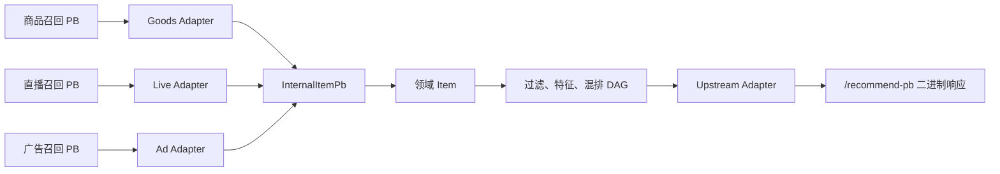

# V13：真实 Protobuf、多协议 Adapter 与统一内部 Item

这一版对应实习描述里的两个关键问题：

1. 商品、直播、广告召回服务返回的 PB 定义都不同；
2. 如果接入层直接把每一种下游 PB 转成每一种上游 PB，转换代码会迅速失控。

V13 不再只用 Java 对象口头模拟 PB，而是增加 5 份真实 `.proto`，由 `protoc` 生成 Java 类，并提供真正返回二进制 Protobuf 的 HTTP 接口。

## 1. 先理解：程序为什么需要“协议”

Java 内存中的 `Item` 对象不能直接通过网络发给另一个进程。发送方要先把对象编码成字节，接收方再把字节还原成对象：

```text
Java 对象 --序列化--> 01 0A 31 ... --网络--> 字节 --反序列化--> Java 对象
```

协议规定了：

- 有哪些字段；
- 字段是什么类型；
- 每个字段在二进制中的编号；
- 新旧版本如何兼容。

JSON 也属于协议。它可读性好，但字段名会重复出现在报文中，解析通常也更慢。Protocol Buffers（简称 Protobuf 或 PB）使用 schema 描述结构，再生成类型安全代码，网络报文是紧凑的二进制。

## 2. `.proto` 和生成代码是什么关系

商品协议中的一段定义：

```proto
message GoodsRecallItemPb {
  int64 goods_id = 1;
  string goods_title = 2;
  string category = 3;
  double relevance_score = 4;
  repeated GoodsAttributePb attributes = 5;
}
```

`goods_id = 1` 中的 `1` 是字段号，不是默认值。二进制报文主要依靠字段号识别字段。

Maven 在编译前调用 `protoc`，生成 `GoodsRecallItemPb` 等 Java 类。业务代码随后可以这样使用：

```java
GoodsRecallItemPb item = GoodsRecallItemPb.newBuilder()
        .setGoodsId(101L)
        .setGoodsTitle("Phone")
        .build();

byte[] bytes = item.toByteArray();
GoodsRecallItemPb decoded = GoodsRecallItemPb.parseFrom(bytes);
```

生成目录是 `target/generated-sources/protobuf/java`，它属于构建产物，不应该手工修改，也不需要提交 Git。要改字段，应修改 `src/main/proto/*.proto` 后重新构建。

## 3. 为什么三路召回不能共用下游协议

不同团队维护的服务有不同业务语义：

| 召回源 | 下游 item ID | 分数 | 特有字段 |
|---|---|---|---|
| 商品 | `goods_id` | `double relevance_score` | 商品属性 |
| 直播 | `product_id` | `float prediction_score` | `room_id`、直播特征 |
| 广告 | `promoted_goods_id` | `score_micros`，百万分之一整数 | `creative_id`、广告扩展 |

这些字段不只是“名字不同”。例如广告的 `625000` 必须除以 `1_000_000` 才是内部的 `0.625`；直播间 ID 不是商品 ID，不能误当成推荐 item ID。

Adapter 的职责就是翻译语义，而不只是复制字段：

```text
GoodsRecallResponsePb -- Goods Adapter --+
LiveRecallResponsePb  -- Live Adapter  ---+--> InternalRecallResultPb
AdRecallResponsePb    -- Ad Adapter    ---+
```

本项目的具体映射：

```text
goods_id          -> item_id
product_id        -> item_id，room_id 放入 attrs
promoted_goods_id -> item_id，creative_id 放入 attrs
score_micros      -> score_micros / 1_000_000.0
```

这种 Adapter 也叫防腐层（Anti-Corruption Layer）：下游协议怎么命名、怎么升级，影响先被隔离在对应 Adapter 内，不会扩散到整个推荐 DAG。

## 4. 统一内部 PB 为什么能降低复杂度

假设有 3 种下游格式、4 种上游格式。

直接两两转换，最坏需要：

```text
3 × 4 = 12 组转换关系
```

引入统一内部格式后，只需要：

```text
3 个下游 -> Internal
Internal -> 4 个上游
总计 3 + 4 = 7 组转换关系
```

当上下游继续增加时，前者是乘法增长，后者是加法增长。这就是“统一接入层 PB”真正解决的架构问题。

V13 的完整数据流是：



## 5. 为什么有 Internal PB 以后还要领域 Item

两者的职责不同：

- PB 是进程边界上的传输对象，强调协议稳定和序列化；
- 领域 `Item` 是业务运行对象，支持改分、按枚举访问属性等业务操作。

不建议在整个业务代码中到处直接操作生成类。否则协议字段一变，核心算法、算子和测试都会跟着变化。

当前转换链路为：

```text
下游 PB -> InternalItemPb -> Item -> 算子处理 -> UpstreamRecommendItemPb
```

## 6. `repeated attr` 为什么要收敛成 `map`

下游把属性定义成列表：

```text
[("price", "3999"), ("stock", "20"), ("status", "online")]
```

查找 `status` 可能要从头遍历，平均和最坏复杂度都是 O(n)。Internal PB 改成：

```proto
map<string, string> attrs = 6;
```

生成的 Java API 提供 `getAttrsMap()` 和 `getAttrsOrThrow(key)`，按 key 查询的平均复杂度是 O(1)。进入领域对象后，字符串 key 又通过 `AttrName.fromKey` 注册表转为 `EnumMap`，既避免散落的 hard code，也保持 O(1) 查找。

### 重复 key 怎么办

列表可能同时出现：

```text
("recall_reason", "old")
("recall_reason", "new")
```

V13 明确定义为“最后一个合法值覆盖前面的值”，空 key 被忽略。`ProtoAdapterTest` 对这一行为做了单测。生产项目必须明确这类冲突策略，否则不同调用方可能产生不一致结果。

注意：Protobuf 的 `map` 在二进制层仍编码为重复的 entry 消息，map 主要改善生成 API 和内存访问方式。

## 7. 类型转换最容易踩的坑

### float 与 double

直播下游使用 `float`，内部使用 `double`。转换成 double 并不能找回 float 已经丢失的精度。因此线上 Diff 通常要给浮点分数设置合理误差阈值，而不是盲目使用 `==`。

### 定点整数

广告使用 `score_micros`，用整数表达百万分之一。优点是跨语言结果稳定，缺点是 Adapter 必须知道缩放比例。忘记除以一百万会使排序完全错误。

### proto3 默认值与字段存在性

普通 proto3 标量字段未赋值时会读到默认值，例如 `int64` 为 0、字符串为空。若业务必须区分“没有传”和“明确传了 0”，应使用 `optional` 或 wrapper 类型，并在 Adapter 做校验。

## 8. 协议升级怎样保证兼容

必须遵守以下规则：

1. 已发布字段号不能改变含义，也不能被新字段复用；
2. 删除字段后，用 `reserved` 保留它的编号和名称；
3. 优先新增字段，不直接改变已有字段类型；
4. 枚举的 0 值应定义为 `UNSPECIFIED`；
5. 新字段必须有旧客户端可以接受的默认行为；
6. 升级时同时测试“新服务端 + 旧客户端”和“旧服务端 + 新客户端”。

为什么新增字段通常兼容？新服务端发来旧客户端不认识的字段号时，Protobuf 会把它存入 unknown fields；旧代码仍可读取认识的字段。V13 的测试手工写入字段号 99，再用现有类解析，证明 item ID、标题不受影响且未知字段仍被保留。

“能解析”不代表“业务一定兼容”。如果新字段改变了旧字段的业务解释，二进制解析虽然成功，推荐结果仍可能错误，所以 Adapter 测试和影子 Diff 都不可少。

## 9. 本项目如何真正返回 PB

普通接口仍返回便于人阅读的 JSON：

```text
GET /recommend?userId=123&scene=mall&limit=10
Content-Type: application/json
```

V13 新增二进制接口：

```text
GET /recommend-pb?userId=123&scene=mall&limit=10
Content-Type: application/x-protobuf
X-Proto-Message: mini_reco.upstream.UpstreamRecommendResponsePb
```

浏览器直接显示二进制乱码是正常现象。调用方必须拿同一份 schema 生成代码，然后用 `UpstreamRecommendResponsePb.parseFrom(bytes)` 解码。

本项目还提供 `ProtoResponseDecoder`，用于读取保存到磁盘的 PB 响应并打印前三个 item。

## 10. 一键运行

```powershell
.\scripts\run-protobuf-demo.ps1
```

脚本会自动：

1. 生成 PB 代码、运行单测并打包；
2. 启动可执行 JAR；
3. 请求 JSON 接口作为对照；
4. 请求 `/recommend-pb` 并保存二进制文件；
5. 使用生成的 Java 类反序列化；
6. 停止本地进程。

二进制响应保存在：

```text
target/recommend-response.pb
```

本机完整运行结果：

| 验证项 | 结果 |
|---|---:|
| JUnit 测试 | 38/38 通过 |
| 新增协议专项测试 | 6/6 通过 |
| JSON 返回 item | 10 |
| PB 解码后 item | 10 |
| 本次 PB 报文大小 | 1427 bytes |

报文大小和耗时会随 requestId、标题、属性和机器环境变化，这里的数字用于证明本地真实完成了二进制 round-trip，不是固定性能结论。

也可手工执行：

```powershell
mvn clean package
java -jar target\mini-reco-access-layer-0.1.0-SNAPSHOT.jar 8080
Invoke-WebRequest "http://localhost:8080/recommend-pb?userId=123&scene=mall&limit=10" -OutFile target\response.pb
java -cp target\mini-reco-access-layer-0.1.0-SNAPSHOT.jar com.interview.minireco.proto.ProtoResponseDecoder target\response.pb
```

## 11. 为什么 JAR 要做成 fat JAR

生成的 PB 类运行时依赖 `protobuf-java`。普通 Maven JAR 只包含本项目 class，直接 `java -jar` 会报 `NoClassDefFoundError`。

V13 使用 Maven Shade Plugin，把本项目和运行依赖打进同一个可执行 JAR。这样 Docker 或服务器只需复制一个 JAR 即可启动。测试通过但没有验证最终打包物，仍可能在线上启动失败，所以接口冒烟测试是发布流程的一部分。

## 12. Windows 中文路径问题

本项目位于包含中文的路径中。Windows 原生命令行直接把中文路径传给 `protoc` 时，曾被错误转换为 `??`，导致“目录不存在”。

V13 在 `protobuf-maven-plugin` 中启用：

```xml
<useArgumentFile>true</useArgumentFile>
```

参数通过 UTF-8 文件交给 `protoc`，`mvn clean package` 因而能在当前中文路径正常生成代码。这不是业务逻辑问题，却是“项目能不能让其他人拉下来直接构建”的工程质量问题。

## 13. JUnit 和 Mockito 在这一版分别怎么用

协议转换是纯函数，直接用 JUnit 最合适：

```text
自己构造 GoodsRecallResponsePb
-> 调用 GoodsRecallProtoAdapter
-> 断言 item_id、score、attrs
```

这里不需要 Mockito，因为 Adapter 没有外部依赖。若要测试“召回 RPC 超时后是否兜底”，才适合 mock 下游客户端，让它抛超时异常，再断言算子返回空结果并记录指标。

判断原则：

- 只需要构造输入和验证输出：JUnit；
- 被测对象依赖数据库、RPC、时钟等协作者：JUnit + Mockito；
- 不要为了使用 Mock 而 Mock 纯数据对象。

## 14. 当前边界与下一步

当前三路召回服务是本地模拟器，但它们构造的是 `protoc` 生成的真实消息；`/recommend-pb` 也进行了真实二进制序列化。尚未引入真正的跨进程 gRPC 调用。

生产化的下一步通常是：

- 使用 gRPC 定义召回 RPC；
- 配置 deadline、连接池、负载均衡和 tracing；
- 建立 schema 仓库和兼容性 CI；
- 对 PB 大小、序列化耗时和 unknown field 做监控；
- 为敏感字段做分级、脱敏和访问控制。

面试时要如实区分“真实 PB 代码生成与二进制接口”和“真实远程 RPC”。前者本版已经完成，后者可以作为后续演进。

## 15. 面试表达模板

可以这样讲：

> 接入层要调用商品、直播、广告等多个召回服务，它们的 PB 字段、ID 语义和分数类型都不同。若核心算子直接依赖这些下游协议，协议变化会扩散到整条链路，上下游之间还会形成大量两两转换。我们为每一路实现 Adapter，先统一转换为接入层 InternalItem PB，再转换为业务领域 Item。属性从 repeated list 收敛成 map，并用枚举注册表消除硬编码，指定属性查询由遍历变为平均 O(1)。出口再由独立 Adapter 转成上游 PB。测试覆盖了字段语义、定点分数、重复 key、未知属性和新增字段兼容；最终还启动 fat JAR，通过二进制接口做了序列化和反序列化冒烟验证。

面试官追问“为什么不让所有服务直接使用同一个 PB”时，可以回答：

> 各服务的领域语义和发布节奏不同，强迫全公司共享一个巨大协议会造成跨团队耦合。接入层应该尊重服务边界，用防腐层把外部模型翻译成自己稳定的内部模型。

追问“PB 新增字段一定安全吗”时，可以回答：

> 二进制层面通常可向前兼容，旧客户端会忽略或保留未知字段；但业务语义不一定兼容，所以仍要遵守字段号规则、定义默认行为，并做新旧版本互测和影子 Diff。
