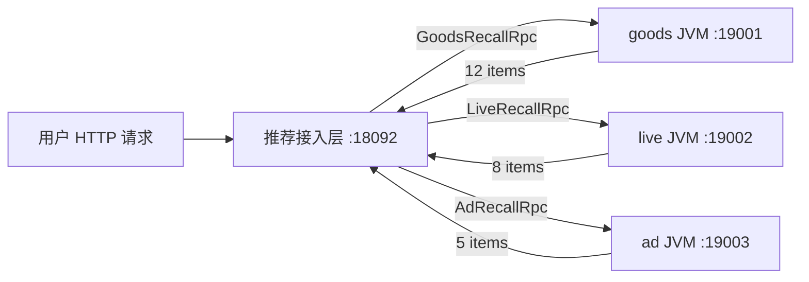

# V14：真实 gRPC 多进程召回、Deadline 与上下文透传

V13 已经有真实 `.proto`、生成类和二进制序列化，但三路“下游服务”仍然在接入层 JVM 内构造返回值。V14 再向真实生产架构前进一步：

- goods、live、ad 分别运行在三个独立 Java 进程；
- 推荐接入层运行在第四个进程；
- 四个进程只通过 TCP + HTTP/2 + gRPC 通信；
- 进程间传输的是 Protobuf 二进制消息；
- live 进程被强制停止后，goods 和 ad 结果仍能返回；
- live 重启并重置熔断器后，系统可以恢复。

## 1. 先分清四个概念

### Protobuf

Protobuf 负责定义消息结构和二进制序列化。例如：

```proto
message GoodsRecallRequestPb {
  int64 user_id = 1;
  string preferred_category = 2;
  string scene = 3;
}
```

它回答的是：“请求里有哪些字段，怎么编码成字节？”

### RPC

RPC 是 Remote Procedure Call，远程过程调用。调用者写起来像调用一个函数：

```java
GoodsRecallResponsePb response = stub.recall(request);
```

但这个函数并不在当前 JVM 执行。底层会把请求编码、通过网络发给远程进程、等待响应并解码。

### gRPC

gRPC 是一套 RPC 框架。它把 Protobuf、HTTP/2、代码生成、连接管理、状态码、deadline、metadata 等能力组合起来。

它回答的是：“怎样找到远端服务、怎样发送请求、超时和失败怎样表达？”

### HTTP 接口

本项目的 `/recommend` 是用户访问接入层的 HTTP/JSON 接口；接入层内部再通过 gRPC 调用召回服务。两者可以同时存在：

```text
用户 -- HTTP/JSON --> 推荐接入层 -- gRPC/PB --> 召回服务
```

## 2. 四进程架构



这里的“进程独立”意味着：

- 每个进程有自己的 JVM、堆内存和线程；
- live 进程崩溃不会直接使 goods 进程崩溃；
- 不同服务可以使用不同端口、资源配额和发布节奏；
- 调用必然经过真实 socket，而不是普通 Java 方法调用。

学习项目仍然在一台电脑上运行四个进程。生产环境中，它们通常部署在不同容器或机器上。

## 3. `.proto` 怎样定义远程方法

V14 在三份下游协议中增加 request 和 service：

```proto
service GoodsRecallRpc {
  rpc Recall(GoodsRecallRequestPb) returns (GoodsRecallResponsePb);
}
```

这是一种 unary RPC：一个请求对应一个响应。

gRPC 还支持：

- 服务端流式：一个请求，持续返回多个响应；
- 客户端流式：持续发送多个请求，最后得到一个响应；
- 双向流式：双方同时持续收发。

推荐召回通常一次请求返回一批 item，unary 已经足够，不需要为了“高级”强行使用流式 RPC。

## 4. 生成代码里有什么

Maven 的 `protobuf-maven-plugin` 执行两个目标：

```text
compile        -> 生成 Protobuf 消息类
compile-custom -> 生成 gRPC service 和 stub
```

商品协议会生成：

```text
GoodsRecallRequestPb
GoodsRecallResponsePb
GoodsRecallRpcGrpc
```

`GoodsRecallRpcGrpc` 中又提供：

- async stub：异步回调；
- blocking stub：当前线程等待结果；
- future stub：返回 Future；
- ImplBase：服务端继承并实现方法。

V14 使用 blocking stub，因为推荐 DAG 已经通过独立线程并行执行 goods、live、ad。这样代码容易理解，又不会让三路变回串行：

```text
召回线程 1 阻塞等待 goods RPC
召回线程 2 阻塞等待 live RPC
召回线程 3 阻塞等待 ad RPC
```

注意：生产中不能在 Netty I/O event loop 上执行 blocking stub，否则会阻塞整个网络线程。本项目的调用发生在召回 bulkhead 工作线程中。

## 5. 客户端一次调用经历什么

以商品召回为例：

```text
RecommendContext
  -> 读取 userId、scene、preferredCategory
  -> 构建 GoodsRecallRequestPb
  -> 设置 70ms deadline
  -> metadata 写入 x-request-id
  -> blockingStub.recall(request)
  -> 收到 GoodsRecallResponsePb
  -> GoodsRecallProtoAdapter
  -> InternalItemPb
  -> 领域 Item
```

客户端入口是 `GrpcGoodsRecallService`，直播和广告结构相同。

## 6. Channel 和 Stub 分别是什么

### Channel

Channel 管理到服务端的长期逻辑连接，包括：

- 名称解析；
- TCP/HTTP2 连接；
- 连接状态；
- 负载均衡；
- 多个 RPC 复用同一连接。

Channel 创建成本较高，不能每个请求都 new 一个。V14 每个下游只创建一个 Channel，并在四条新旧/影子 pipeline 之间共享底层 gRPC client。

### Stub

Stub 是基于 Channel 生成的类型安全调用代理。Stub 很轻量，可以在每次调用时派生并增加：

- deadline；
- metadata interceptor；
- 压缩配置；
- 调用凭证。

本项目每次调用从共享 Channel 创建一个配置过的 blocking stub。

## 7. 为什么要设置 Deadline

不设 deadline，调用方可能一直等到 TCP 或系统级超时。推荐系统有严格总耗时预算，不能让一个弱依赖无限占用线程。

V14 的预算关系是：

```text
gRPC deadline       70ms
单路韧性层 timeout  80ms
并行召回总 deadline 120ms
```

内层 deadline 必须小于外层 timeout：

1. 70ms 到达后，gRPC 主动取消 RPC并返回 `DEADLINE_EXCEEDED`；
2. 客户端把它转换成已有 `DownstreamTimeoutException`；
3. V10 韧性层识别为 timeout，决定是否有限重试；
4. 多次失败后执行空结果兜底和熔断；
5. 召回 fan-out 最晚仍受 120ms 总预算保护。

如果外层先超时，工作线程只会看到 interrupt/cancelled，错误分类、日志和指标会变得不准确。

deadline 是端到端剩余时间概念，不只是本地 `Thread.sleep` 计时。gRPC 会把 deadline 信息传给服务端，服务端可通过 Context 检查请求是否已经取消，并提前停止无意义计算。

## 8. gRPC 状态码怎样映射到业务治理

常见状态码：

| gRPC status | 含义 | 本项目处理 |
|---|---|---|
| `OK` | 成功 | 转换 PB，返回 items |
| `DEADLINE_EXCEEDED` | 超过调用预算 | 转为 `DownstreamTimeoutException` |
| `UNAVAILABLE` | 服务未启动、连接断开等 | 转为 `DownstreamCallException` |
| `INVALID_ARGUMENT` | 参数错误 | 当前统一按调用错误处理，生产应区分不可重试 |
| `UNAUTHENTICATED` | 身份认证失败 | 不应重试，应告警和排查凭证 |
| `RESOURCE_EXHAUSTED` | 限流或资源耗尽 | 根据策略退避或降级 |

不能对所有错误无脑重试。例如参数错误重试一百次也不会成功；服务过载时立即重试还可能放大故障。当前 V10 的重试策略是学习版，生产中应根据 status、幂等性和剩余 deadline 决定。

## 9. Request ID 为什么放 Metadata

requestId 不参与召回业务计算，却要贯穿日志和链路追踪。如果把它混入每一个业务 message，会污染所有协议。

V14 使用 gRPC metadata：

```text
x-request-id: 6e34aa3f-80f7-4cd1-b0db-1b121e56a2d8
```

客户端 interceptor 写入 header，服务端 interceptor 读取后放进 gRPC Context。服务实现从 Context 取出 requestId，写入结构化日志。

因此可以从接入层日志中的 requestId，查到 goods、live、ad 三个独立进程的对应日志。集成测试也会启动真实 socket 服务，断言 requestId 确实到达服务端，而不是只测试一个工具函数。

生产系统还会在 metadata 中传播 traceparent、调用方身份、灰度标签等信息，但要限制大小并避免传递敏感数据。

## 10. local 与 grpc 两种传输模式

默认仍然使用 local：

```text
reco.recall.transport=local
```

这样 V1～V13 的演示脚本无需同时启动三个下游，仍可独立运行。

启动真实 gRPC 模式时使用 JVM 参数：

```powershell
java `
  -Dreco.recall.transport=grpc `
  -Dreco.grpc.goods.target=localhost:19001 `
  -Dreco.grpc.live.target=localhost:19002 `
  -Dreco.grpc.ad.target=localhost:19003 `
  -Dreco.grpc.deadline.ms=70 `
  -jar target\mini-reco-access-layer-0.1.0-SNAPSHOT.jar 18092
```

也支持环境变量：

```text
RECALL_TRANSPORT
GRPC_GOODS_TARGET
GRPC_LIVE_TARGET
GRPC_AD_TARGET
GRPC_DEADLINE_MS
```

`/health` 会显示当前 transport、三个 target 和 deadline，避免排障时不知道进程实际使用哪套配置。

## 11. 手工启动四个进程

先打包：

```powershell
mvn clean package
```

三个终端分别启动下游：

```powershell
java -cp target\mini-reco-access-layer-0.1.0-SNAPSHOT.jar com.interview.minireco.grpc.server.DownstreamGrpcApplication goods 19001
java -cp target\mini-reco-access-layer-0.1.0-SNAPSHOT.jar com.interview.minireco.grpc.server.DownstreamGrpcApplication live 19002
java -cp target\mini-reco-access-layer-0.1.0-SNAPSHOT.jar com.interview.minireco.grpc.server.DownstreamGrpcApplication ad 19003
```

第四个终端按上一节命令启动接入层，然后请求：

```powershell
Invoke-RestMethod "http://localhost:18092/health"
Invoke-RestMethod "http://localhost:18092/recommend?userId=123&scene=mall&limit=10"
Invoke-RestMethod "http://localhost:18092/metrics"
```

## 12. 一键四进程演示

```powershell
.\scripts\run-grpc-multiprocess-demo.ps1
```

脚本会自动：

1. 运行单测并构建 fat JAR；
2. 启动三个下游 JVM；
3. 以 grpc 模式启动接入层 JVM；
4. 验证三路健康召回；
5. 检查 gRPC client 指标和 requestId 跨进程日志；
6. 强制杀掉 live JVM；
7. 验证 goods + ad 部分结果和 live fallback；
8. 重启 live 并重置 circuit；
9. 验证三路完全恢复；
10. 清理全部子进程。

## 13. 本地真实结果

| 场景 | 召回量 | 返回量 | live 状态 | transport |
|---|---:|---:|---|---|
| 三路健康 | 25 | 10 | SUCCESS | grpc |
| live 进程被杀 | 17 | 10 | FALLBACK | grpc |
| live 重启恢复 | 25 | 10 | SUCCESS | grpc |

测试结果：

```text
41 tests, 0 failures, 0 errors, 0 skipped
```

其中 3 个新增测试覆盖：

- 三种客户端通过真实随机 TCP 端口调用服务端；
- requestId metadata 跨网络到达服务端 Context；
- gRPC deadline 转换为已有下游超时异常。

可执行 fat JAR 约 20.5MB，包含 Netty、gRPC、Protobuf 和相关运行依赖。

## 14. 为什么要做协议运行时预热

引入更完整的 Protobuf/gRPC 运行库后，历史 V11 演示第一次请求曾出现三路未收齐：真实业务 sleep 只有 20～45ms，但首次加载生成类、构建 descriptor 和 JIT 的额外成本使调用超过了 80/120ms 预算。

这不是放大线上 deadline 就能正确解决的问题。冷启动成本不应该由第一个真实用户承担。V14 增加 `ProtoRuntimeWarmup`，在 HTTP Server 开始监听前主动初始化：

- 三种下游消息和属性 entry；
- 三个 PB Adapter 和领域转换；
- 三个 gRPC method descriptor；
- 上游 PB response 类。

预热不发业务请求、不写调用指标，也不会改变召回结果。预热后，V11 健康 fan-out 首次实测 54ms，三路全部完成。

生产环境还会结合 readiness probe、JIT 预热、连接预建和小流量 warm-up。协议类预热只解决本项目实际发现的 class/descriptor 初始化成本，不应被描述为解决了所有冷启动问题。

## 15. 为什么打包后曾经无法解析 localhost

第一次四进程验证时，普通 classpath 单测全部通过，但 fat JAR 启动失败：

```text
Address types of NameResolver 'unix' for 'unix:///localhost:19001'
not supported by transport
```

原因不是 target 写错，而是 gRPC 使用 Java SPI 文件注册：

```text
META-INF/services/io.grpc.NameResolverProvider
META-INF/services/io.grpc.LoadBalancerProvider
```

多个依赖 JAR 都包含同名 SPI 文件。Shade 若只保留一份，会丢失 DNS resolver，最终错误选择 unix resolver。

V14 使用 `ServicesResourceTransformer` 合并这些文件，而不是覆盖：

```xml
<transformer implementation="org.apache.maven.plugins.shade.resource.ServicesResourceTransformer"/>
```

这说明：

> `mvn test` 通过，只能证明测试 classpath 正常；最终部署产物必须真正启动并走一遍接口。

这个问题很适合在面试中体现工程排障能力：先看最终进程日志，根据异常识别 NameResolver，再检查 shaded JAR 的 SPI 资源合并规则，最后用四进程脚本回归。

## 16. JUnit、Mockito 和集成测试怎样选择

本版没有用 Mockito 假装网络成功，而是让 JUnit 启动随机端口 gRPC Server，再让真实 client 连接。

因为以下能力只有真实 gRPC 栈才能覆盖：

- Protobuf 序列化和反序列化；
- HTTP/2 socket 通信；
- client/server interceptor；
- metadata 和 Context；
- deadline 与 status 映射；
- generated stub 和 service 是否匹配。

Mockito 仍适合测试更上层的业务分支，例如：模拟 `RecallService` 抛出超时，验证算子是否兜底。它不适合替代所有网络集成测试。

可以把测试金字塔理解为：

```text
大量 JUnit 纯单测：快，定位精确
少量真实 gRPC 集成测试：验证协议和网络边界
更少的四进程端到端测试：验证最终部署产物
```

## 17. 当前离真正生产环境还差什么

V14 已经是真实多进程 RPC，但仍是本地学习环境：

- 使用 plaintext，没有 TLS/mTLS；
- target 是固定 localhost，没有注册中心或 Kubernetes DNS；
- 未启用标准 gRPC health checking；
- 未启用 server reflection，grpcurl 不能自动发现服务；
- 没有 OpenTelemetry trace；
- 服务端没有按调用方做鉴权、限流和配额；
- 没有配置最大消息大小、keepalive 和连接老化；
- 下游服务仍与接入层打在同一个 JAR，只是运行成不同进程。

这些是后续容器化和可观测性演进的方向。面试中不要说“已经达到完整生产环境”，而应准确说明当前完成了真实网络边界、故障隔离和部署包验证。

## 18. 面试表达模板

可以这样介绍：

> 我们先用 Protobuf 为商品、直播和广告定义独立协议，再生成 gRPC service 和 blocking stub。接入层保留一个 Channel 对应一个下游，三路 RPC 由召回 fan-out 线程并行执行，不会串行阻塞。每次调用设置 70ms deadline，并通过 client interceptor 把 requestId 放入 metadata；服务端 interceptor 再写入 Context 和结构化日志。`DEADLINE_EXCEEDED`、`UNAVAILABLE` 会转换为统一下游异常，继续复用原有超时、重试、熔断和兜底。我们用四个真实 JVM 做端到端验证：健康时召回 25 条；杀掉 live 后仍返回 goods+ad 的 17 条候选；重启并重置熔断后恢复到 25 条。

面试官追问“为什么使用 blocking stub 还能并行”时：

> blocking 只表示当前调用线程等待 RPC，不代表三路共用一个线程。DAG 的 fan-out 会把三路提交到不同工作线程，所以三路等待时间重叠。需要避免的是在 Netty event loop 中执行 blocking 调用。

追问“为什么既有 70ms deadline 又有 80ms timeout”时：

> gRPC deadline 控制真实远程调用并向服务端传播取消语义；80ms 是接入层对整个 delegate 任务的最后保护，覆盖客户端代码、序列化和线程调度。内层先到期，错误分类更清楚，外层用于防止客户端实现本身失控。

追问“Channel 为什么不能每次创建”时：

> Channel 持有连接、线程、名称解析和负载均衡状态，每次创建会重复握手并消耗资源。它应该按下游长期复用，Stub 则可以低成本派生并携带单次调用的 deadline 和 metadata。
