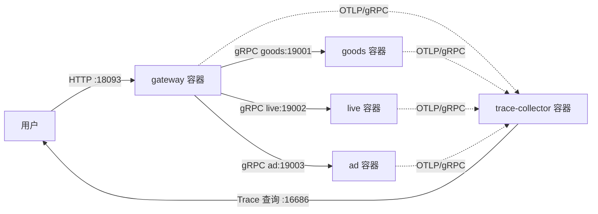
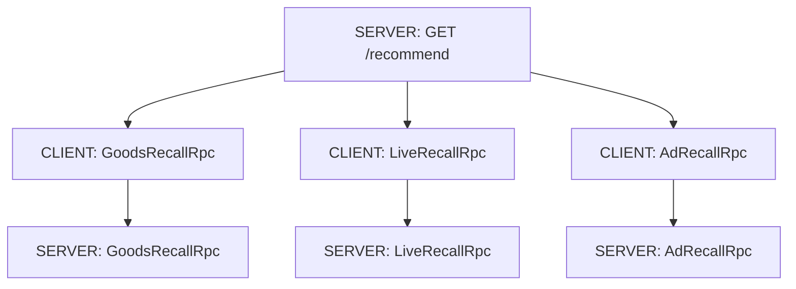

# V15：Docker Compose 部署、服务治理与 OpenTelemetry 链路追踪

V14 已经把接入层、商品召回、直播召回和广告召回拆成四个 JVM，但仍需要手动启动和停止进程。V15 把它们进一步变成可编排、可健康检查、可观测的容器化系统：

- 一个 Docker 镜像运行五种不同角色；
- Docker Compose 一键启动网关、三路召回和 Trace Collector；
- 容器通过 Compose DNS 发现彼此，不再写死本机端口；
- gRPC 服务提供标准 Health Checking 和 Server Reflection；
- HTTP 与 gRPC 调用通过 W3C `traceparent` 传播上下文；
- OpenTelemetry 将一条请求在四个业务进程中的 Span 汇总成同一条 Trace；
- 演示脚本真实停止直播容器，验证部分结果、熔断兜底和自动恢复。

## 1. 先建立整体认识



正常请求产生 25 条召回结果：

```text
goods 12 + live 8 + ad 5 = 25
```

停止 live 容器后，系统仍返回另外两路结果：

```text
goods 12 + live 0 + ad 5 = 17
```

这正是接入层的核心价值：它不只是“转发请求”，还负责并行调用、超时控制、故障隔离、部分结果和可观测性。

## 2. Docker、镜像、容器和 Compose 分别是什么

### 2.1 镜像

镜像可以理解为不可变的“应用安装包 + 运行环境”。本项目镜像包含：

- Java 17 运行时；
- fat JAR；
- JVM 默认参数；
- 默认启动命令。

`Dockerfile` 中最关键的几行是：

```dockerfile
ARG RUNTIME_IMAGE=eclipse-temurin:17-jre-jammy
FROM ${RUNTIME_IMAGE}
COPY target/mini-reco-access-layer-0.1.0-SNAPSHOT.jar /app/app.jar
USER 65532:65532
ENTRYPOINT ["java"]
```

`USER 65532:65532` 表示应用不以 root 身份运行。即使应用被利用，攻击者默认也不会直接获得容器内最高权限。

### 2.2 容器

容器是镜像的一次运行实例。同一个镜像可以启动多个容器，并用不同命令扮演不同角色：

```text
同一 app.jar
  + DownstreamGrpcApplication goods 19001 -> goods 容器
  + DownstreamGrpcApplication live  19002 -> live 容器
  + DownstreamGrpcApplication ad    19003 -> ad 容器
  + MiniRecoApplication 8080              -> gateway 容器
  + TraceCollectorApplication 4317 16686  -> trace-collector 容器
```

这种做法适合学习项目，因为只维护一个构建产物。真实大厂也可能按服务分别构建镜像，以获得独立依赖、独立版本和更小镜像。

### 2.3 Docker Compose

Compose 用一个 `compose.yaml` 描述一组容器怎样一起运行，包括：

- 启动命令；
- 环境变量；
- 网络；
- 端口映射；
- 健康检查；
- 启动依赖；
- CPU、内存和文件系统限制。

因此，不需要打开五个终端逐个输入启动命令，只需：

```powershell
docker compose up -d --wait
```

`-d` 表示后台运行，`--wait` 表示等待服务健康，而不只是等待容器进程创建成功。

## 3. 服务发现：为什么网关能访问 `goods:19001`

Compose 会创建一个名为 `reco` 的 bridge 网络，并为其中的服务提供内部 DNS。网关配置为：

```yaml
GRPC_GOODS_TARGET: goods:19001
GRPC_LIVE_TARGET: live:19002
GRPC_AD_TARGET: ad:19003
```

这里的 `goods` 不是随便写的字符串，而是 Compose service 名。网关容器查询 `goods` 时，Docker DNS 会返回 goods 容器在内部网络中的地址。

要分清两类端口：

| 地址 | 谁访问 | 是否暴露给宿主机 |
|---|---|---|
| `goods:19001` | gateway 容器 | 否 |
| `live:19002` | gateway 容器 | 否 |
| `ad:19003` | gateway 容器 | 否 |
| `localhost:18093` | 电脑上的用户 | 是，映射到 gateway 的 8080 |
| `localhost:16686` | 电脑上的用户 | 是，映射到 Trace 查询端口 |

只把用户真正需要访问的端口暴露出来，可以缩小攻击面。

生产环境中的服务发现可能由 Kubernetes Service、注册中心或 Service Mesh 完成，但核心问题相同：调用方如何从稳定的逻辑名称找到不断变化的服务实例。

## 4. 健康检查不是“端口能连上”

端口打开只能说明某个进程正在监听，不能说明服务已具备处理业务的能力。例如：

- 依赖尚未初始化；
- 配置加载失败；
- 服务正在优雅下线；
- 线程池已经不可用。

V15 为三个 gRPC 服务注册 `HealthStatusManager`，并设置两级状态：

```text
""                                      -> 整个 gRPC Server
"mini_reco.goods.GoodsRecallRpc"        -> 具体业务服务
```

启动完成后状态是 `SERVING`；关闭时先改成非服务状态。`GrpcHealthProbe` 使用标准 gRPC Health 协议发起检查，而不是调用一遍商品召回来假装健康检查。

这样做的好处是：

- Docker、Kubernetes、负载均衡器和运维工具可以使用统一协议；
- 健康探针不会污染业务指标或制造假召回流量；
- 可以分别判断整个进程和具体服务是否可用。

网关和 Trace Collector 是 HTTP 服务，所以使用轻量的 `HttpHealthProbe` 请求 `/health`。

## 5. gRPC Reflection 是什么

普通 gRPC 客户端需要提前拿到 `.proto` 或生成代码，才知道服务有哪些方法。Reflection 允许客户端在运行时向服务器询问：

```text
你提供哪些 service？
某个 service 有哪些 method？
这些 method 使用什么消息描述？
```

V15 注册 `ProtoReflectionServiceV1`，演示脚本使用 `GrpcReflectionClient` 验证 goods 服务确实暴露：

```text
mini_reco.goods.GoodsRecallRpc
```

Reflection 主要用于调试、探索和通用工具，例如 grpcurl。它不是服务发现：

- 服务发现解决“实例在哪里”；
- Reflection 解决“这个 gRPC Server 提供什么接口”。

生产环境是否开启 Reflection 要根据安全策略决定。内部调试环境通常很有价值，公网暴露时则要考虑接口信息泄露和访问控制。

## 6. 为什么只有日志还不够

假设用户反馈一次推荐请求耗时很高。日志可能分散在四个服务中：

```text
gateway.log
goods.log
live.log
ad.log
```

requestId 可以帮助搜索，但你仍要手动拼接时间线。分布式链路追踪把一次请求建模为：

- Trace：完整请求链路；
- Span：链路中的一段操作；
- TraceId：整条链路共同的 ID；
- SpanId：某一段操作自己的 ID；
- ParentSpanId：指出这段操作由谁调用。

V15 的正常请求大致形成 7 个 Span：



三个 CLIENT Span 表示网关发出的远程调用，三个 SERVER Span 表示三个召回服务收到并执行调用，加上一个 HTTP SERVER Span，总计 7 个。

## 7. Trace 上下文怎样跨进程传播

进程之间不共享 Java 对象，`ThreadLocal` 也不可能穿过网络。因此必须把追踪上下文编码到协议头中。

V15 使用 W3C Trace Context 标准。核心头类似：

```text
traceparent: 00-<32位traceId>-<16位spanId>-01
```

传播过程是：

1. `TracingHttpHandler` 从上游 HTTP header 提取父 Context，没有则创建新 Trace；
2. 它创建 `GET /recommend` HTTP SERVER Span，并使其成为当前 Context；
3. `RecommendContext` 保存当前 OTel Context，保证并行召回线程仍能找到父 Span；
4. 每个 gRPC 客户端创建 CLIENT Span；
5. `GrpcTelemetry.inject` 把 CLIENT Span 上下文写入 gRPC Metadata；
6. 下游 server interceptor 从 Metadata 提取 Context；
7. 下游创建 SERVER Span，执行完成后记录 gRPC status 并结束 Span。

这里最容易犯的错误是“创建了 Span，但没有传播 Context”。结果会看到七条互不相关的 Trace，而不是一棵完整调用树。

另一个容易犯的错误是只在进入 interceptor 时 `makeCurrent()`，随后 gRPC 切换线程，业务回调就丢失 Context。因此 `GrpcTelemetry` 对 `onMessage`、`onHalfClose`、`onComplete` 等 listener 回调重新建立 Scope。

## 8. OpenTelemetry 各组件负责什么

OpenTelemetry，简称 OTel，是可观测数据的标准和工具集。本项目用到：

- API：创建 Span、读取 TraceId；
- SDK：采样、处理、批量发送 Span；
- Propagator：按 W3C 标准注入和提取上下文；
- OTLP Exporter：使用标准 OTLP/gRPC 导出 Trace；
- Resource：给数据附加 `service.name`、版本、环境等服务身份。

Compose 中的关键配置是：

```yaml
OTEL_SDK_DISABLED: "false"
OTEL_EXPORTER_OTLP_ENDPOINT: http://trace-collector:4317
OTEL_EXPORTER_OTLP_PROTOCOL: grpc
OTEL_TRACES_EXPORTER: otlp
OTEL_SERVICE_NAME: mini-reco-gateway
OTEL_RESOURCE_ATTRIBUTES: deployment.environment=compose,service.version=v15
```

同一个镜像启动不同服务时，必须配置不同 `OTEL_SERVICE_NAME`，否则 Collector 里所有 Span 都会显示成同一个服务，失去定位意义。

普通本地运行时 OTel 默认关闭，避免没有 Collector 时不断尝试导出；Compose 显式打开。这体现了“代码提供能力，环境决定是否启用”的配置原则。

## 9. 为什么项目内置一个轻量 Trace Collector

本项目的 `TraceCollectorApplication` 实现标准 OTLP/gRPC `TraceService`，接收并按 TraceId 保存 Span，同时提供：

```text
GET /health
GET /api/traces/{traceId}
```

这样不依赖外部平台，也能完整学习 SDK、上下文传播、OTLP 导出和跨服务 Trace 聚合。

但必须讲清边界：它是学习和自动验收用的内存 Trace Sink，不是生产级可观测平台。它没有：

- 持久化存储；
- 数据保留和清理策略；
- 鉴权与多租户；
- 采样策略管理；
- 完整的 Trace 瀑布图 UI；
- 高可用和水平扩展。

生产环境通常把 OTLP 数据发送到 OpenTelemetry Collector，再转发至 Jaeger、Tempo、SkyWalking 或商业 APM。应用侧的 OTLP 协议保持不变，替换后端不需要重写业务追踪代码。

## 10. Docker 配置里的上线意识

`compose.yaml` 还包含几项容易在面试中被追问的配置：

### 非 root 运行

镜像使用固定的非特权 UID/GID，降低容器逃逸或文件误操作的风险。

### 只读根文件系统

```yaml
read_only: true
tmpfs:
  - /tmp:size=64m
```

应用不能随意修改镜像文件；确实需要临时写入的 `/tmp` 使用内存文件系统。生产服务应把持久数据写到专门存储，而不是写在容器可写层。

### 资源限制

```yaml
mem_limit: 256m
cpus: 0.50
```

资源不是无限的。显式限制能让测试更接近生产，也能暴露 OOM、线程数和 GC 配置问题。JVM 使用 `MaxRAMPercentage` 根据容器内存上限计算堆大小。

### 依赖健康状态

gateway 等待三路召回健康后启动，三路召回等待 Collector 健康后启动。这能提高演示确定性，但不能替代应用自身重试：运行期间任何依赖仍可能宕机。

## 11. 一键运行并读懂结果

前置条件：Java 17、Maven、Docker Desktop 和 Docker Compose。

运行：

```powershell
.\scripts\run-docker-compose-demo.ps1
```

脚本依次完成：

1. 运行 42 个测试并打 fat JAR；
2. 校验 Compose 并构建镜像；
3. 启动五个容器并等待健康；
4. 验证 gRPC Reflection 和标准 Health；
5. 请求网关，验证三路共 25 条；
6. 根据响应头 `X-Trace-Id` 查询跨服务 Trace；
7. 停止 live，等待系统稳定为 17 条和 `FALLBACK`；
8. 重启 live，等待 gRPC 长连接退出重连退避并恢复 25 条；
9. 输出结果并清理容器。

实际验收结果：

```text
Scenario            RecallItems  LiveStatus  TraceSpans
healthy                      25  SUCCESS              7
live_container_down          17  FALLBACK              -
live_recovered               25  SUCCESS               -
```

若想在演示后保留容器以便手动学习：

```powershell
.\scripts\run-docker-compose-demo.ps1 -KeepRunning
docker compose ps
docker compose logs -f gateway
docker compose down --volumes --remove-orphans
```

如果 Docker Hub 暂时不可访问，但本机已有其他 Java 17 基础镜像，可覆盖：

```powershell
$env:MINI_RECO_RUNTIME_IMAGE = "你的本地Java17镜像:tag"
.\scripts\run-docker-compose-demo.ps1
```

## 12. 怎样手动观察 Trace

保留容器后请求网关：

```powershell
$response = Invoke-WebRequest `
  "http://localhost:18093/recommend?userId=125&scene=mall&limit=10" `
  -UseBasicParsing
$traceId = [string]@($response.Headers["X-Trace-Id"])[0]
$traceId
```

查询 Trace：

```powershell
Invoke-RestMethod "http://localhost:16686/api/traces/$traceId" |
  ConvertTo-Json -Depth 10
```

重点检查：

- `spanCount` 是否至少为 7；
- `serviceNames` 是否包含四个业务服务；
- 所有 Span 的 `traceId` 是否一致；
- gRPC SERVER Span 的 `parentSpanId` 是否等于对应 CLIENT Span 的 `spanId`；
- 三路 gRPC Span 是否在时间线上重叠，证明 fan-out 确实并行。

## 13. JUnit 在这一版怎样测试分布式追踪

`GrpcTracePropagationTest` 不依赖 Docker，也不调用外网。它在测试进程中：

1. 创建 `InMemorySpanExporter`；
2. 启动一个真实随机端口 gRPC Server；
3. 创建一个模拟 HTTP 父 Span；
4. 使用真实 gRPC client 调用 goods；
5. 断言共得到 HTTP、CLIENT、SERVER 三个 Span；
6. 断言它们 TraceId 相同；
7. 断言 SERVER 的 ParentSpanId 等于 CLIENT 的 SpanId。

这也能帮助你区分 JUnit 和 Mock：这条测试没有 Mock 网络结果，而是构造了受控的真实 gRPC 通信环境，然后断言可观测结果。适合快速验证传播逻辑；Compose 演示再负责验证真实多容器环境。

## 14. 本次排障中真正值得学习的两个问题

### 14.1 标准错误流不等于命令失败

JVM 和 Netty 会把部分 INFO 提示写到 stderr。PowerShell 在严格错误模式下可能把这些文本包装成异常，即使命令退出码为 0。

可靠脚本应以原生进程退出码判断成功失败，并按需分别处理 stdout/stderr，不能看到 stderr 就一律认定失败。

### 14.2 服务健康不等于调用链立即恢复

live 重启后，本机健康探针可以立刻成功，但 gateway 中原有 gRPC `ManagedChannel` 经历过连接失败，仍可能处于指数重连退避。

因此恢复验收需要等待两个条件都成立：

```text
服务端已经 SERVING
+ 调用端连接已经重建
+ 熔断器已经允许请求
= 端到端业务恢复
```

这是非常好的面试细节：健康检查描述单个实例状态，端到端可用性还受客户端连接、DNS、负载均衡、超时和熔断状态影响。

## 15. 面试时可以这样介绍 V15

> 在完成 gRPC 多进程拆分后，我继续补齐了容器化部署和分布式可观测能力。使用同一个 fat JAR 镜像，通过 Docker Compose 编排网关、三路召回和 Trace Collector；容器间通过 Compose DNS 以服务名发现，三路 gRPC 服务接入标准 Health Checking 和 Reflection。链路追踪使用 OpenTelemetry，在 HTTP 入口创建 SERVER Span，在网关调用侧和召回服务侧分别创建 gRPC CLIENT/SERVER Span，并通过 W3C traceparent 在 gRPC Metadata 中传播上下文。正常请求能聚合出横跨四个服务的 7 个 Span。演示中真实停止 live 容器后，系统保留 goods 和 ad 的 17 条部分结果并触发 fallback；重启后同时等待服务健康、gRPC 长连接重连和熔断恢复，最终回到 25 条。容器使用非 root、只读根文件系统、资源限制和健康依赖。学习环境内置了一个兼容 OTLP/gRPC 的内存 Trace Sink，生产中可以无侵入替换成 OTel Collector 加 Jaeger 或 Tempo。

## 16. 高频追问与回答

### 为什么不直接把 requestId 当 TraceId？

requestId 便于业务日志检索，但没有标准的父子 Span 模型、跨协议传播约定、耗时树和采样语义。两者可以同时存在：requestId 面向业务排查，TraceId 面向分布式调用链。

### 为什么客户端和服务端都要创建 Span？

CLIENT Span 描述调用方看到的排队、网络和等待耗时；SERVER Span 描述服务端实际处理耗时。两者之差能帮助判断时间消耗在网络、连接建立还是服务内部。

### 为什么 Trace 导出不能阻塞用户请求？

可观测性是辅助能力，不能让 Collector 抖动直接拖慢推荐主链路。SDK 使用批处理器异步导出；代价是 Trace 在请求结束后会稍晚到达，所以脚本采用轮询等待。

### Health、readiness、liveness 有什么区别？

- liveness：进程是否还活着，失败通常触发重启；
- readiness：是否应接收流量，失败通常从负载均衡摘除；
- 通用 gRPC Health：提供标准服务状态，本项目用它实现容器健康检查。

Compose 只展示单一 healthcheck；迁移到 Kubernetes 时应根据语义拆分 readiness 和 liveness，避免下游短暂故障导致无意义重启。

### 为什么 Collector 不直接放进网关进程？

Collector 是独立基础设施角色。独立部署能汇总多个服务的数据，避免某个业务服务重启导致 Trace 丢失，也便于独立扩容和更换后端。本项目虽然复用同一镜像，但运行时仍是独立容器和进程。

## 17. 这一版还可以怎样继续演进

下一阶段可以选择：

1. 用正式 OpenTelemetry Collector + Jaeger/Tempo 替换学习 Trace Sink；
2. 增加 Prometheus 指标采集和 Grafana 面板；
3. 增加 Kubernetes Deployment、Service、ConfigMap 和探针；
4. 将日志、指标、Trace 通过 traceId 和 exemplars 关联；
5. 增加采样策略、敏感字段治理和可观测性开销压测；
6. 使用 Testcontainers 把多容器验收纳入 CI。

学习顺序建议是：先画出 7 个 Span 的父子关系，再手动运行脚本观察 Trace JSON，最后阅读 `TracingHttpHandler`、`AbstractGrpcRecallService`、`GrpcTelemetry` 和 `TraceStore`。能脱离代码讲明白“为什么要传播 Context、在哪里创建 Span、何时结束 Span”，才算真正掌握。
