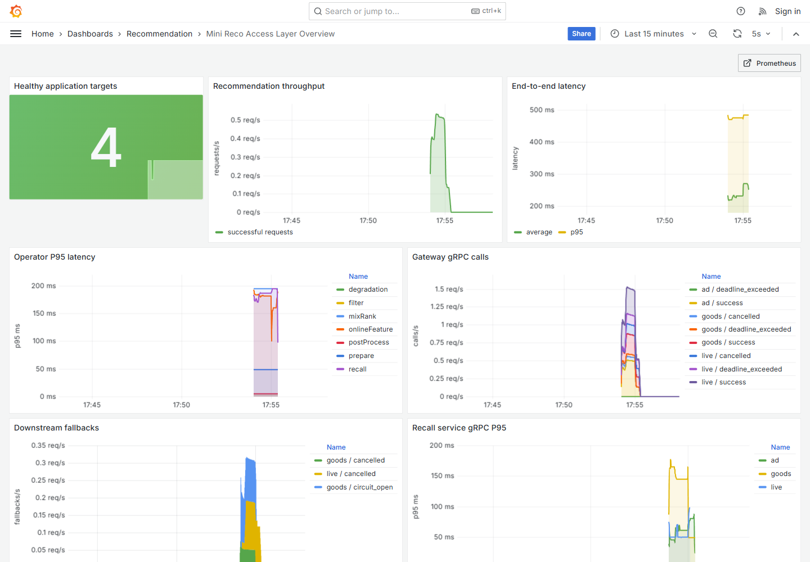
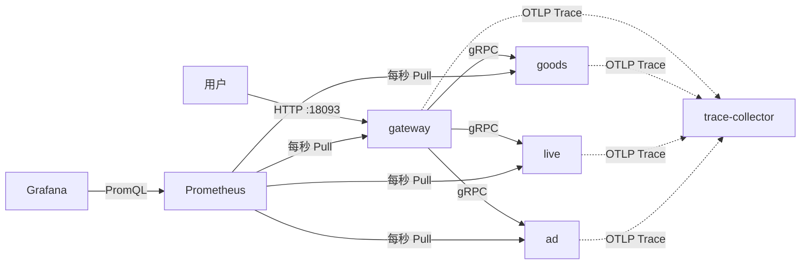

# V16：Prometheus 指标、Grafana 面板与可执行告警

V15 已经具备结构化日志和 OpenTelemetry Trace，但生产系统还需要回答另一类问题：

- 现在每秒有多少请求？
- 成功率和兜底率是否发生变化？
- 平均耗时、P95 耗时是多少？
- 是哪个算子、哪一路召回正在变慢？
- 某个服务宕机后，系统能否自动发现并报警？

这些问题适合用 Metrics，也就是指标解决。V16 使用真实 Prometheus 2.50.0 和 Grafana 10.4.2，把“代码打点 → 指标暴露 → 定时采集 → PromQL 查询 → Dashboard → 告警”完整串起来。



## 1. 日志、指标和 Trace 各自解决什么问题

三者经常被称为可观测性的三大支柱，但用途不同。

### 日志 Logs

日志记录离散事件，例如：

```json
{
  "event": "downstream_fallback",
  "requestId": "...",
  "source": "live",
  "reason": "timeout"
}
```

它适合回答：“这一次请求具体发生了什么？”

### 指标 Metrics

指标是按时间持续采集的数值，例如：

```text
每秒请求数 = 1200
过去一分钟直播兜底次数 = 15
请求 P95 = 230ms
健康实例数 = 4
```

它适合回答：“整个系统现在是否正常？趋势是否变化？”

### 链路 Trace

Trace 还原一次请求跨多个进程的父子调用关系，适合回答：“慢在哪一段远程调用？”

三者不是互相替代，而是常见的排障顺序：

```text
指标发现异常
  -> Dashboard 判断影响范围和异常时间
  -> Trace 定位慢服务或慢调用
  -> 日志查看具体错误和业务上下文
```

## 2. V16 的七容器架构



端口分工：

| 服务 | 业务端口 | 指标端口 | 宿主机入口 |
|---|---:|---:|---:|
| gateway | 8080 | 与业务端口相同 | 18093 |
| goods | 19001 | 19101 | 不暴露 |
| live | 19002 | 19102 | 不暴露 |
| ad | 19003 | 19103 | 不暴露 |
| Prometheus | 9090 | 9090 | 19090 |
| Grafana | 3000 | 3000 | 13000 |
| Trace Collector | 4317 | 16686 查询 | 16686 |

Prometheus 在 Compose 内部访问 `gateway:8080`、`goods:19101` 等逻辑服务名，不需要把三个召回指标端口暴露到电脑上。

## 3. Prometheus 为什么使用 Pull 模型

V16 的应用不会主动把指标一条条发给 Prometheus。每个进程只在 HTTP 端点展示当前快照，Prometheus 定时来抓：

```text
Prometheus --GET /metrics/prometheus--> 应用
Prometheus <--文本格式指标------------ 应用
```

这叫 Pull 模型。

优点包括：

- Prometheus 统一控制抓取频率；
- 某个采集目标不可访问时，`up` 指标会直接变为 0；
- 应用不需要知道 Prometheus 实例地址；
- 本地可以直接打开端点检查原始数据；
- Prometheus 能给样本自动增加 `job`、`instance` 等标签。

短生命周期批处理任务不适合长时间等待 Pull，通常会使用 Pushgateway；普通在线服务更适合 Pull。

## 4. Prometheus 的四种主要指标类型

### 4.1 Counter：只增不减的累计值

例如成功请求总数：

```text
mini_reco_request_success_total{scene="mall"} 22
```

Counter 进程重启后可以从 0 重新开始。查询“每秒多少请求”时，不直接看累计值，而是使用 `rate`：

```promql
sum(rate(mini_reco_request_success_total[1m]))
```

### 4.2 Gauge：可增可减的瞬时值

例如线程池当前活跃线程数、队列长度、JVM 堆使用量。Prometheus 自动生成的 `up` 也可以理解为当前状态：

```text
up = 1  抓取成功
up = 0  抓取失败
```

本项目还把每个耗时指标观测到的最大值暴露成 Gauge，例如：

```text
mini_reco_request_cost_seconds_max 0.48
```

### 4.3 Histogram：把观测值放入固定桶

请求耗时不是一个简单 Counter。为了计算分位数，V16 使用固定毫秒桶：

```text
5, 10, 25, 50, 100, 200, 500, 1000, 2500, 5000, 10000, +Inf
```

假设观测到两次请求：120ms 和 280ms，累积桶大致是：

```text
le=0.1   -> 0
le=0.2   -> 1
le=0.5   -> 2
le=1.0   -> 2
le=+Inf  -> 2
```

注意桶是累积的。120ms 不只进入 `le=0.2`，也会计入所有更大的桶。

标准暴露格式还包括：

```text
mini_reco_request_cost_seconds_count 2
mini_reco_request_cost_seconds_sum   0.4
```

平均耗时可以由 `sum / count` 得到；P95 可以由桶近似计算。

### 4.4 Summary

Summary 也能计算分位数，但通常在客户端进程内计算，多个实例的 quantile 不容易正确聚合。Histogram 的桶可以跨实例相加，更适合本项目这种多服务、多实例场景。

因此 V16 选择 Histogram。

## 5. 为什么统一换算成秒

Java 代码中的 `recordTimer` 使用毫秒，但 Prometheus 命名规范建议时间指标使用基本单位 seconds：

```text
Java 内部：280 ms
Prometheus：0.28 seconds
```

因此指标名是：

```text
mini_reco_request_cost_seconds_bucket
mini_reco_request_cost_seconds_count
mini_reco_request_cost_seconds_sum
```

Grafana 展示时再乘以 1000 或指定毫秒单位。单位明确比把 `cost=280` 丢给使用者猜测更可靠。

## 6. 从项目原有 MetricsRegistry 到标准暴露格式

V7 已有 `MetricsRegistry`，但 `/metrics` 返回项目自定义 JSON。V16 保留这个旧端点，避免破坏已有脚本，同时增加：

```text
GET /metrics/prometheus
Content-Type: text/plain; version=0.0.4; charset=utf-8
```

`MetricSample` 现在区分：

```java
COUNTER
TIMER
```

`MetricsRegistry` 对 TIMER 同时保存：

- count：观测次数；
- total：耗时总和；
- max：最大耗时；
- bucketCounts：每个累积桶的次数。

`PrometheusMetricsFormatter` 负责：

1. 给指标增加 `mini_reco_` 前缀；
2. 将 `request.cost` 转成合法的 `request_cost`；
3. Counter 增加 `_total` 后缀；
4. TIMER 输出 Histogram bucket/count/sum；
5. 毫秒换算为秒；
6. 排序并转义 label，防止引号、反斜杠和换行破坏文本格式；
7. 输出 `# HELP` 和 `# TYPE` 元数据。

示例：

```text
# HELP mini_reco_request_cost_seconds Duration distribution for request.cost.
# TYPE mini_reco_request_cost_seconds histogram
mini_reco_request_cost_seconds_bucket{le="0.2",scene="mall",status="success"} 8
mini_reco_request_cost_seconds_bucket{le="0.5",scene="mall",status="success"} 22
mini_reco_request_cost_seconds_bucket{le="+Inf",scene="mall",status="success"} 22
mini_reco_request_cost_seconds_count{scene="mall",status="success"} 22
mini_reco_request_cost_seconds_sum{scene="mall",status="success"} 5.13
```

## 7. 标签 Label 有什么用，为什么也有风险

同一个指标可以通过标签分组：

```text
mini_reco_grpc_client_call_total{source="goods",status="success"}
mini_reco_grpc_client_call_total{source="live",status="deadline_exceeded"}
```

这样不需要为 goods、live、ad 分别定义三个完全不同的指标名。

但标签的每一种组合都会形成一条独立 Time Series。以下字段不能随便作为标签：

- userId；
- requestId；
- itemId；
- 完整 URL；
- 未归一化的异常消息。

这些字段取值可能无限增长，会造成高基数，消耗 Prometheus 内存和磁盘。V16 只使用有限枚举标签，例如 source、status、reason、operator、scene。

面试时可以说：日志和 Trace 可以记录 requestId，指标标签必须严格控制基数。

## 8. 为什么三个召回服务需要独立指标端口

V15 的三个召回服务只有 gRPC 业务端口。Prometheus 抓取通常使用 HTTP，所以 V16 为每个召回进程启动轻量 `MetricsHttpServer`：

```text
goods:19101/metrics/prometheus
live:19102/metrics/prometheus
ad:19103/metrics/prometheus
```

`GrpcTelemetry.serverInterceptor` 在业务 RPC 结束时记录：

```text
grpc.server.call
grpc.server.call.cost
```

标签包括 source、method 和 status。这样可以同时比较：

- 网关看到的 CLIENT 耗时；
- 召回服务看到的 SERVER 耗时；
- 各服务成功和失败的调用次数。

如果 CLIENT 明显慢于 SERVER，问题可能位于连接、网络、排队或序列化；如果两者同时变慢，更可能是服务端业务处理变慢。

## 9. Prometheus 抓取配置

`monitoring/prometheus/prometheus.yml` 定义两个 job：

```yaml
- job_name: mini-reco-gateway
  metrics_path: /metrics/prometheus
  static_configs:
    - targets: [gateway:8080]

- job_name: mini-reco-recall
  metrics_path: /metrics/prometheus
  static_configs:
    - targets: [goods:19101, live:19102, ad:19103]
```

学习环境使用静态目标，因为服务数量固定。生产 Kubernetes 中通常使用服务发现自动查找 Pod，并通过 relabeling 生成规范标签。

本项目抓取间隔为 1 秒，方便短时间演示看到曲线。生产环境常见 10～30 秒，需要在及时性、Prometheus 压力和存储成本之间权衡。

## 10. 必须掌握的 PromQL

### 10.1 查看健康目标数

```promql
sum(up{job=~"mini-reco-.+"})
```

正常值是 4：gateway、goods、live、ad。

### 10.2 查看每秒成功请求数

```promql
sum(rate(mini_reco_request_success_total[1m]))
```

`rate` 处理 Counter 单调增长和进程重启归零，返回平均每秒增长速度。

### 10.3 查看一分钟新增兜底次数

```promql
sum by (source, reason) (
  increase(mini_reco_downstream_fallback_total[1m])
)
```

`increase` 更适合表达窗口内总共新增多少次。

### 10.4 计算平均请求耗时

```promql
sum(rate(mini_reco_request_cost_seconds_sum{status="success"}[1m]))
/
sum(rate(mini_reco_request_cost_seconds_count{status="success"}[1m]))
```

得到秒；Grafana 面板乘 1000 展示毫秒。

### 10.5 计算 P95

```promql
histogram_quantile(
  0.95,
  sum by (le) (
    rate(mini_reco_request_cost_seconds_bucket{status="success"}[1m])
  )
)
```

`histogram_quantile` 根据桶边界做近似。桶设计过粗时，分位数精度也会变粗；桶太多则会增加 Time Series 数量。

### 10.6 按算子比较 P95

```promql
histogram_quantile(
  0.95,
  sum by (le, operator) (
    rate(mini_reco_operator_cost_seconds_bucket{status="success"}[1m])
  )
)
```

这里必须保留 `le`，因为 Histogram quantile 需要桶上界；同时保留 `operator` 才能分别显示各算子。

## 11. 告警规则和状态机

V16 配置三条规则：

| 告警 | 条件 | 等待时间 |
|---|---|---:|
| `MiniRecoTargetDown` | 某个 `up == 0` | 5 秒 |
| `MiniRecoLiveFallback` | 1 分钟内 live fallback 增加 | 立即 |
| `MiniRecoHighRequestP95` | 请求 P95 超过 500ms | 1 分钟 |

一个带 `for` 的告警会经历：

```text
Inactive
  -> 条件首次成立
Pending
  -> 条件持续满足 for 时长
Firing
  -> 条件恢复
Inactive / Resolved
```

`for` 能过滤瞬时抖动。如果目标只失败一次抓取就立刻呼叫值班同学，容易制造告警风暴；如果等待时间过长，又会延迟发现真实故障。

Prometheus 负责计算和维护告警状态。生产环境通常再接 Alertmanager，完成：

- 告警分组；
- 去重；
- 抑制；
- 静默；
- 路由到电话、短信、邮件、Slack 或企业 IM。

V16 验证规则进入 Firing，但暂未引入外部通知渠道，避免学习项目发送真实消息。

## 12. Grafana Provisioning 为什么比手工点页面更可靠

如果只在本机 Grafana 页面手动添加数据源和面板，其他同学拉取代码后得不到相同环境。

V16 把配置提交到仓库：

```text
monitoring/grafana/provisioning/datasources/prometheus.yml
monitoring/grafana/provisioning/dashboards/dashboards.yml
monitoring/grafana/dashboards/mini-reco-overview.json
```

Grafana 启动时自动：

1. 注册 UID 为 `prometheus` 的数据源；
2. 指向 Compose 内部地址 `http://prometheus:9090`；
3. 创建 `Recommendation` 文件夹；
4. 加载 UID 为 `mini-reco-overview` 的 Dashboard；
5. 设置该 Dashboard 为首页。

这就是 Dashboard as Code。它可以版本控制、Code Review、回滚和在不同环境复现。

## 13. 七个 Dashboard 面板分别看什么

1. `Healthy application targets`：四个应用抓取目标是否全部健康；
2. `Recommendation throughput`：成功推荐请求每秒速率；
3. `End-to-end latency`：平均耗时和 P95；
4. `Operator P95 latency`：prepare、recall、onlineFeature、mixRank 等算子耗时；
5. `Gateway gRPC calls`：网关访问三路召回的状态和速率；
6. `Downstream fallbacks`：按 source 和 reason 分组的兜底；
7. `Recall service gRPC P95`：三个服务端实际处理耗时。

面板不是越多越好。核心原则是每个面板都对应一个明确排障问题，并能从总览逐层下钻。

## 14. Compose Profile 怎样保持版本兼容

Prometheus 和 Grafana 配置：

```yaml
profiles:
  - monitoring
```

因此普通命令：

```powershell
docker compose up -d
```

仍只启动 V15 的五个容器。启用监控 profile：

```powershell
$env:COMPOSE_PROFILES = "monitoring"
docker compose up -d --wait
```

才启动七个容器。

这种可选能力适合学习和本地开发。生产环境一般会把基础设施和业务应用拆成更独立的部署单元。

## 15. 一键演示怎样验收，而不只是“启动成功”

运行：

```powershell
.\scripts\run-monitoring-demo.ps1
```

首次运行会自动拉取 `prom/prometheus:v2.50.0`、`grafana/grafana:10.4.2` 和 Java 17 基础镜像；后续运行直接复用本地缓存。若所在网络无法访问 Docker Hub，可以提前从可用镜像源准备这些镜像，并通过 `MINI_RECO_RUNTIME_IMAGE` 指定本地 Java 17 镜像。

脚本执行：

1. 跑 44 个测试并打包；
2. 用 `promtool` 检查 Prometheus 配置和三条规则；
3. 解析 Dashboard JSON 并检查 Compose；
4. 启动七个容器并等待健康；
5. 生成 20 次以上真实推荐流量；
6. 检查标准 Prometheus 文本和 Histogram；
7. 通过 Prometheus HTTP API 执行 PromQL；
8. 检查 Grafana API 中的数据源和 7 面板 Dashboard；
9. 停止 live，等待 `up=0`、告警 Firing 和业务 17 条兜底；
10. 重启 live，等待 `up=1`、告警恢复和业务回到 25 条。

实际结果：

```text
Scenario            RecallItems  LiveStatus  PrometheusUp  AlertFiring
healthy                      25  SUCCESS                4  no
live_container_down          17  FALLBACK               3  true
live_recovered               25  SUCCESS                4  no

request success samples: 22
gRPC server call samples: 61
```

这比“打开 Grafana 能看到页面”更可靠，因为它验证了数据生产、采集、查询、展示配置、故障发现、告警状态和恢复的完整闭环。

## 16. 手动学习步骤

保留容器：

```powershell
.\scripts\run-monitoring-demo.ps1 -KeepRunning
```

打开 Grafana，无需登录：

```text
http://localhost:13000/d/mini-reco-overview
```

打开 Prometheus：

```text
http://localhost:19090
```

查看原始指标：

```powershell
Invoke-WebRequest "http://localhost:18093/metrics/prometheus" -UseBasicParsing |
  Select-Object -ExpandProperty Content
```

查询 Prometheus API：

```powershell
$query = [uri]::EscapeDataString('sum(up{job=~"mini-reco-.+"})')
Invoke-RestMethod "http://localhost:19090/api/v1/query?query=$query" |
  ConvertTo-Json -Depth 10
```

制造故障：

```powershell
$env:COMPOSE_PROFILES = "monitoring"
docker compose stop live
```

等待约 6 秒后查询告警：

```powershell
$query = [uri]::EscapeDataString(
  'ALERTS{alertname="MiniRecoTargetDown",alertstate="firing"}'
)
Invoke-RestMethod "http://localhost:19090/api/v1/query?query=$query"
```

恢复与清理：

```powershell
docker compose start live
Invoke-RestMethod "http://localhost:18093/resilience?reset=true"
docker compose down --volumes --remove-orphans
Remove-Item Env:COMPOSE_PROFILES -ErrorAction SilentlyContinue
```

## 17. JUnit 测了什么

`PrometheusMetricsFormatterTest` 构造受控数据并断言：

- Counter 是否使用 `_total`；
- Timer 是否声明为 Histogram；
- 120ms 是否进入 0.2 秒及更大桶；
- 280ms 是否进入 0.5 秒及更大桶；
- count 是否为 2；
- sum 是否从 400ms 转成 0.4 秒；
- max 是否从 280ms 转成 0.28 秒；
- label 中的引号、反斜杠和换行是否正确转义。

这属于快速单元测试。真实 Prometheus 是否能解析、抓取和查询，则由 Compose 演示完成。两层测试关注点不同，不能互相替代。

## 18. 面试时可以这样介绍 V16

> 在日志和分布式 Trace 之后，我继续补齐了指标监控闭环。我保留项目原有 JSON metrics，同时新增 Prometheus 标准文本端点；将累计事件建模为 Counter，将请求、算子和 gRPC 耗时建模为固定桶 Histogram，统一转换成 seconds，从而可以通过 count/sum 计算平均值，并使用 histogram_quantile 聚合多实例 P95。网关和三路召回分别作为四个抓取目标，召回服务通过独立指标端口暴露 gRPC server 指标。Prometheus 配置了目标宕机、直播兜底和高 P95 三条规则，Grafana 使用 provisioning 自动加载数据源和 7 个面板，实现 Dashboard as Code。自动化演示真实停止 live 容器后，Prometheus 的健康目标从 4 变为 3，目标宕机告警经过 5 秒从 Pending 进入 Firing，同时业务仍通过 goods 和 ad 返回 17 条结果；重启后 up、告警和业务结果全部恢复。整个流程由 promtool、JUnit、PromQL API 和真实浏览器渲染共同验收。

## 19. 高频追问

### 为什么不用平均值判断性能？

平均值会掩盖长尾。例如 99 次 100ms 和 1 次 10 秒，平均值约 199ms，但最慢用户体验非常差。推荐链路通常同时关注 P50、P95、P99。

### P95 是精确值吗？

Histogram 的 P95 是根据桶插值得到的近似值，精度取决于桶边界。需要根据业务 SLO 和实际耗时分布设计桶。

### `rate` 和 `increase` 有什么区别？

- `rate(counter[1m])`：窗口内平均每秒增长多少；
- `increase(counter[1m])`：窗口内总共增长多少。

二者都能处理 Counter 重启归零。

### 为什么 `up=1` 仍可能业务不可用？

`up=1` 只代表 Prometheus 成功抓到指标端点。业务 gRPC 线程池、数据库或其他依赖仍可能异常。生产系统应同时观察技术健康、错误率、延迟和真实业务成功指标。

### 为什么不用 userId 做标签？

每个不同标签组合都是独立 Time Series。百万用户会产生百万级甚至更多序列，造成高基数。userId 应进入日志或 Trace，不应成为 Prometheus label。

### 为什么告警条件成立后还要 `for`？

为了过滤瞬时网络抖动和单次抓取失败，减少告警风暴。等待时长必须与业务 SLO 和故障容忍度匹配。

## 20. 当前边界和下一步

V16 已经是可运行的真实监控栈，但仍有学习项目边界：

- 只有单实例 Prometheus 和 Grafana，没有高可用；
- 数据只保留 2 小时；
- Grafana 开启匿名只读访问，只适合本机学习；
- 尚未接 Alertmanager 和真实通知渠道；
- 尚未采集 JVM、进程、容器和宿主机指标；
- 固定桶需要根据真实压测分布继续校准；
- Prometheus 使用静态目标，不具备 Kubernetes 动态发现。

下一版可以继续做 Kubernetes 部署：Deployment、Service、ConfigMap、readiness/liveness、滚动发布、HPA，以及 Prometheus ServiceMonitor。也可以先做 Alertmanager 和 SLO 告警，把“组件是否健康”升级成“用户成功率和延迟是否违反服务目标”。
